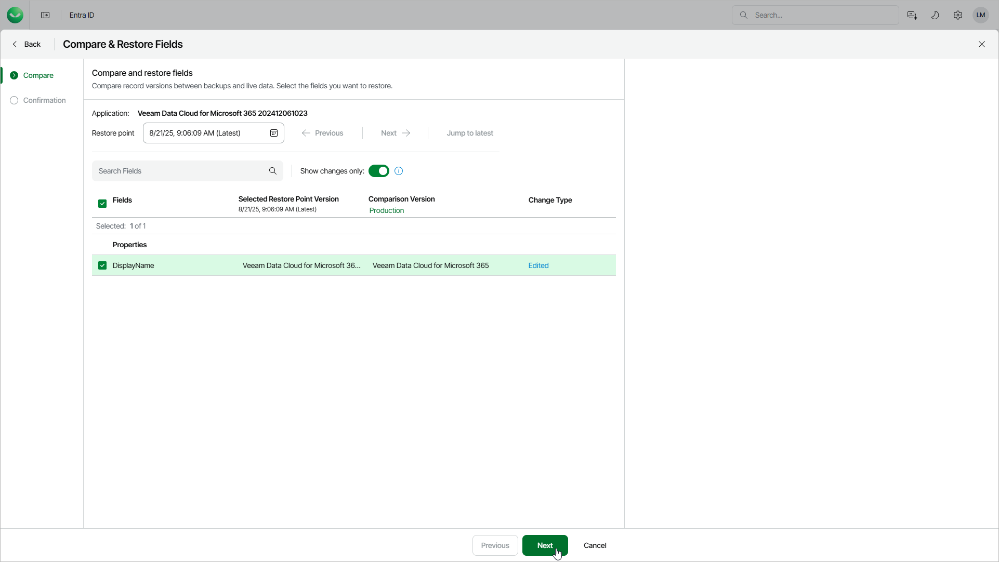

# Step 2. Select Restore Point and Properties

At the Compare step of the wizard, select a restore point and properties that you want to restore. You can compare the property values in the selected restore point with the values in production or in another restore point.

To select a restore point and properties, do to following:

1. Choose the restore point from which you want to restore the data:

* To find a restore point in the restore point calendar, click the Restore point field.
* To change the restore point, click the Previous and Next links.
* To select the latest restore point, click Jump to latest.

1. By default, the list of properties shows only the properties that have changed. To show all properties, set the Show changes only toggle to Off.
2. In the list of properties, select the properties you want to restore.

In the Selected Restore Point Version and Comparison Version columns, you can see property values at different points in time. By default, the Comparison Version column displays the current values in production. To change them to the values from a specific restore point, click Production and select the restore point.

