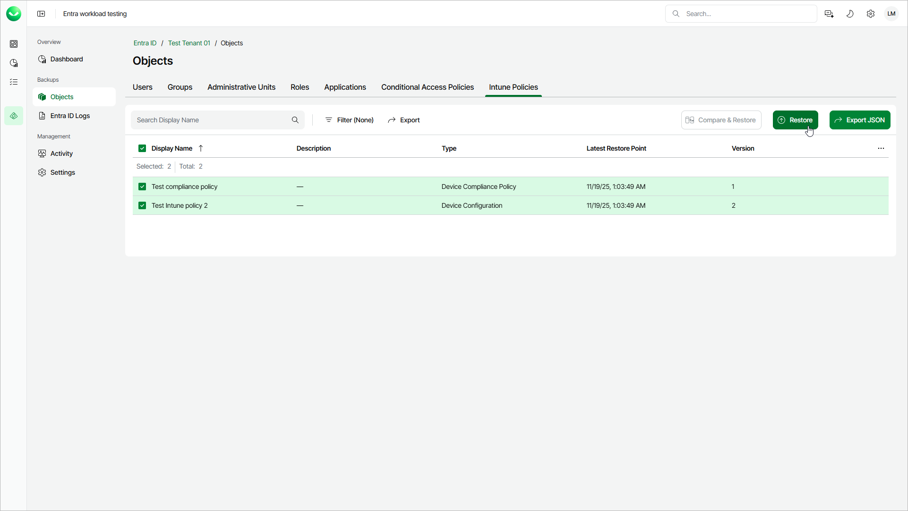

# Step 1. Launch Intune Policies Wizard

In this article

To launch the Restore Intune Policies wizard, do the following:

1. On the Entra ID page, click the name of the tenant you want to manage.
2. Select Objects.
3. Make sure that the Intune Policies tab is selected.
4. In the list of objects, select those you want to restore.

|  |
| --- |
| Tip |
| Consider the following:   * To find an objects by its display name, you can use the search field.  * To show more object properties, click the menu icon and select the properties you want to show. * To filter objects based on whether they are enabled, disabled or report only, click Filter and select the required values. * To export the list of applications for future references and imports, click Export and select the format in which you want to save the list. Veeam Data Cloud will export all backed-up objects and their properties that can be shown in the restore window. |

1. To launch the restore wizard, click Restore

Page updated 12/12/2025
