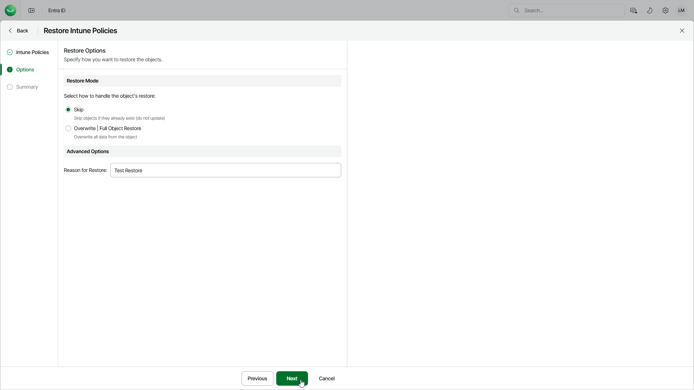

# Step 3. Specify Restore Options

In this article

At the Options step of the wizard, configure the restore options, such as how to restore Intune policies, their relationships and other:

1. In the Restore mode section, specify whether to overwrite Intune policies or skip restore of the already existing items.

* When you select the Skip option, Veeam Data Cloud will not overwrite or update objects that already exists.
* When you select the Overwrite option, Veeam Data Cloud updates fields present in the backup. If a field in the backup is empty, it will be restored as empty. However, Veeam Data Cloud does not update read-only fields (the ID, creation date and so on) and fields that are not present in the backup. For details, see [Supported Entra ID Item Properties](entra_id_properties.md).

1. In the Reason for Restore field, enter a reason for restoring the Intune policies. This information will be saved to the session history, and you will be able to reference it later.

Page updated 11/19/2025
