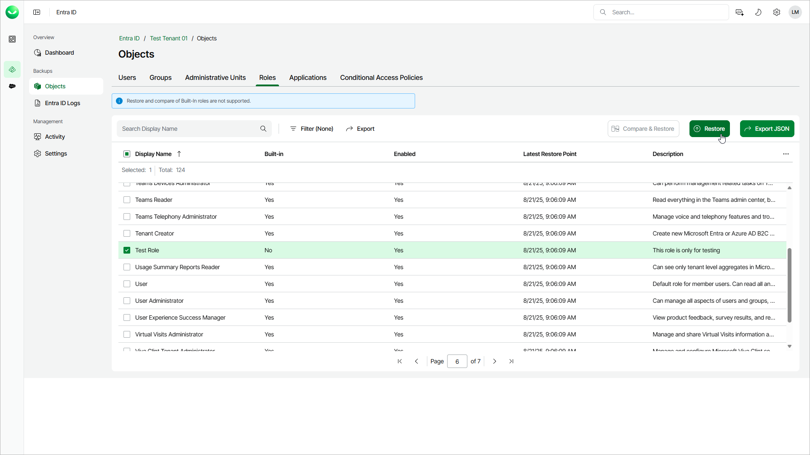

# Step 1. Launch Restore Roles Wizard

In this article

To launch the Restore Roles wizard, do the following:

1. On the Entra ID page, click the name of the tenant you want to manage.
2. Select Objects.
3. Make sure that the Roles tab is selected.
4. In the list of roles, select those you want to restore. The built-in Entra ID roles are read only and cannot be restored.

|  |
| --- |
| Tip |
| Consider the following:   * To find a role by its display name, you can use the search field.  * To show more role properties, click the menu icon and select the properties you want to show. * To filter roles based on whether they are built-in and enabled, click Filter and select the required values. * To export the list of roles for future references and imports, click Export and select the format in which you want to save the list. Veeam Data Cloud will export all backed-up roles and their properties that can be shown in the restore window. |

1. To launch the restore wizard, click Restore.

Page updated 12/12/2025
