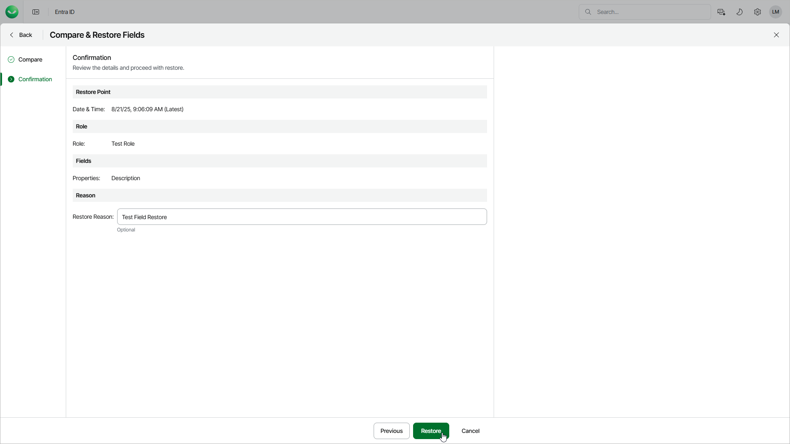

# Step 3. Finish Working with Wizard

In this article

At the Confirmation step of the wizard, review the summary information and click Restore.

In the Restore Reason field, you can enter a reason for restoring the role. This information will be saved to the session history, and you will be able to reference it later.

After you finish the wizard, Veeam Data Cloud will start the restore session. You will receive an email notification once the restore is completed successfully or fails.

Page updated 8/21/2025
