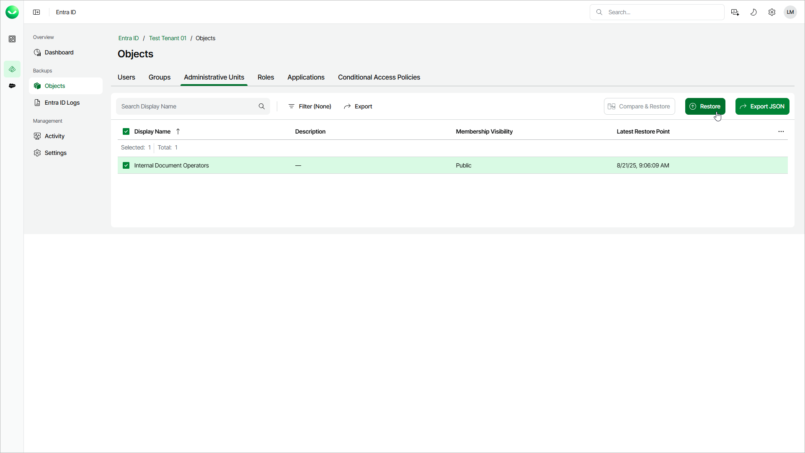

# Step 1. Launch Restore Administrative Units Wizard

In this article

To launch the Restore Administrative Units wizard, do the following:

1. On the Entra ID page, click the name of the tenant you want to manage.
2. Select Objects.
3. Make sure that the Administrative Units tab is selected.
4. In the list of administrative units, select those you want to restore.

|  |
| --- |
| Tip |
| Consider the following:   * To find a administrative unit by its display name, you can use the search field.  * To show more administrative unit properties, click the menu icon and select the properties you want to show. * To filter administrative units by membership visibility, click Filter and select the required values. * To export the list of units for future references and imports, click Export and select the format in which you want to save the list. Veeam Data Cloud will export all backed-up units and their properties that can be shown in the restore window. |

1. To launch the restore wizard, click Restore.

Page updated 12/12/2025
