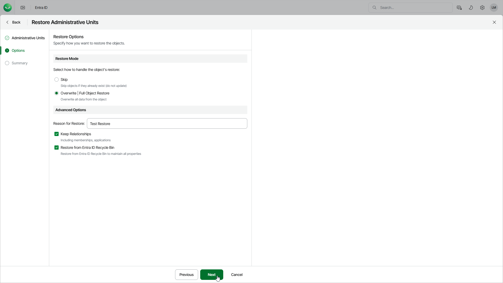

# Step 3. Specify Restore Options

At the Options step of the wizard, configure the restore options, such as how to restore administrative units, their relationships and other:

1. In the Restore mode section, specify whether to overwrite administrative units or skip restore of the already existing units.

* When you select the Skip option, Veeam Data Cloud will not overwrite or update objects that already exists.
* When you select the Overwrite option, Veeam Data Cloud updates fields present in the backup. If a field in the backup is empty, it will be restored as empty. However, Veeam Data Cloud does not update read-only fields (the ID, creation date and so on) and fields that are not present in the backup. For details, see [Supported Entra ID Item Properties](entra_id_properties.md).

1. In the Advanced options section, configure the following:

* In the Reason for Restore field, enter a reason for restoring units. This information will be saved to the session history, and you will be able to reference it later.

* To restore relationships of units within the current tenant, click Keep Relationships. Veeam Data Cloud will restore the following relationships: assigned roles, group members of the unit and user members of the unit. Note that Veeam Data Cloud restores only relationships — if a role, group or user does not exist, they will not be restored.

If you have selected the Overwrite option, Veeam Data Cloud will restore the relationships from the backup and will remove the relationships not present in the backup.

* To restore units from the Entra ID recycle bin instead of the backup, click Restore from Entra ID Recycle Bin. In this case, if the units exist in both the recycle bin and the backup, they will be restored from the recycle bin and will preserve their object IDs. The units that do not exist in the recycle bin will not be restored.

To restore units that cannot be restored from the recycle bin, launch the restore wizard again, select the necessary units and clear the Restore from Entra ID Recycle Bin check box. The units will be restored from the backup and get new object IDs.

