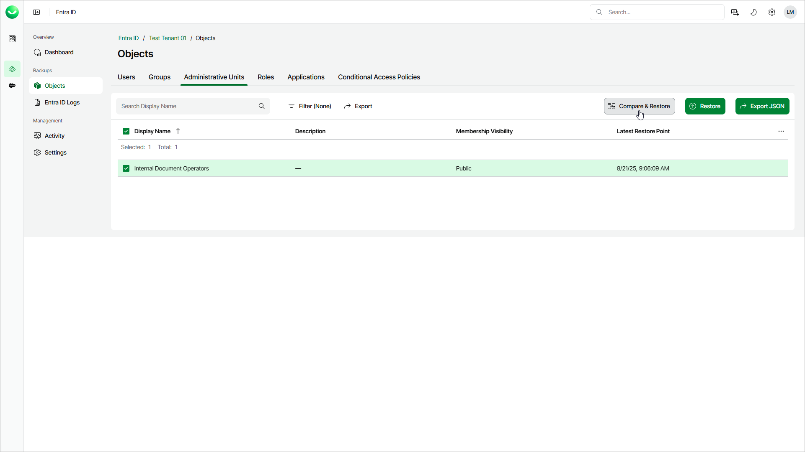

# Step 1. Launch Compare and Restore Fields Wizard

In this article

To launch the restore wizard, do the following:

1. On the Entra ID page, click the name of the tenant you want to manage.
2. Select Objects.
3. Make sure that the Administrative Units tab is selected.
4. Select a unit whose properties you want to restore.

|  |
| --- |
| Tip |
| To find a unit by its display name, you can use the search field. |

1. Click Compare & Restore.

Page updated 10/14/2025
