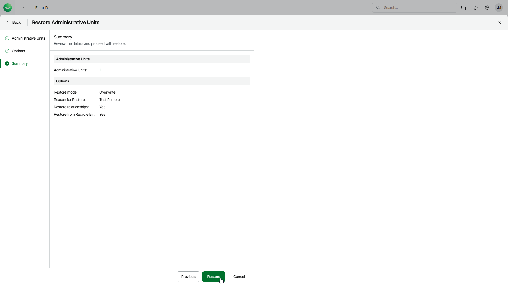

# Step 4. Finish Working with Wizard

In this article

At the Summary step of the wizard, review the summary information and click Restore.

After you finish the wizard, you will confirm the objects to restore and Veeam Data Cloud will start the restore session. You will receive an email notification once the restore is completed successfully or fails.

Page updated 8/21/2025
