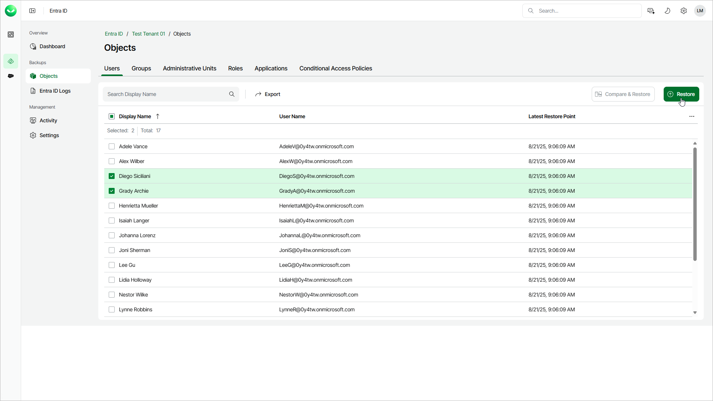

# Step 1. Launch Restore Users Wizard

In this article

To launch the Restore Users wizard, do the following:

1. On the Entra ID page, click the name of the tenant you want to manage.
2. Select Objects.
3. Make sure that the Users tab is selected.
4. In the list of users, select those you want to restore.

|  |
| --- |
| Tip |
| Consider the following:   * To find a user by its display name, you can use the search field. * To show more user properties, click the menu icon and select the properties you want to show. * To export the list of users for future references and imports, click Export and select the format in which you want to save the list. Veeam Data Cloud will export all backed-up users and their properties that can be shown in the restore window. |

1. To launch the restore wizard, click Restore.

Page updated 12/12/2025
