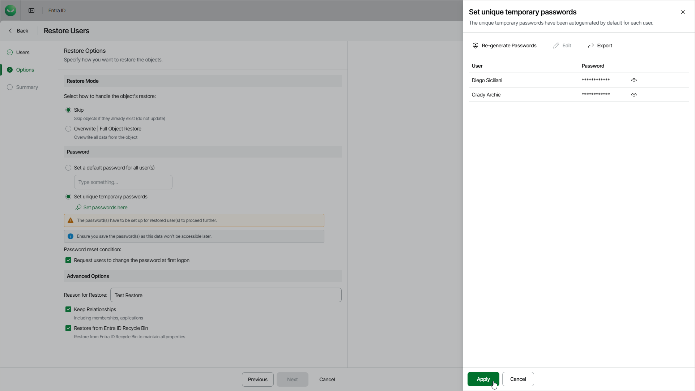

# Step 3. Specify Restore Options

In this article

At the Options step of the wizard, configure the restore options, such as how to restore users, how to set user passwords and so on:

1. In the Restore mode section, specify whether to overwrite users or skip restore of the already existing users.

* When you select the Skip option, Veeam Data Cloud will not overwrite or update objects that already exists.
* When you select the Overwrite option, Veeam Data Cloud updates fields present in the backup. If a field in the backup is empty, it will be restored as empty. However, Veeam Data Cloud does not update read-only fields (the ID, creation date and so on) and fields that are not present in the backup. For details, see [Supported Entra ID Item Properties](entra_id_properties.md).

1. In the Password section, configure new passwords for the restored users:

* To set a default password for all users, specify it in the Set a default password for all users field.
* To set a password for each user, click Set unique temporary passwords. In the Set unique temporary passwords window, specify your own passwords or use auto-generation. To export the list of passwords, click Export.
* To force the restored users to change their password after the first logon, select Request the user to change the password at first logon.
* To force the restored users to use multifactor authentication at the first logon, select Enforce MFA at first logon.

|  |
| --- |
| Tip |
| Consider the following:   * You can set the default password and also specify temporary passwords for individual users. Users for whom you do not specify a temporary password will have the default password. * At the [Summary](entra_id_restore_user_summary.md) step, you will be able to export passwords specified in the Set temporary passwords window. |

1. In the Advanced options section, configure the following:

* In the Reason for Restore field, enter a reason for restoring users. This information will be saved to the session history, and you will be able to reference it later.
* To restore relationships of users within the current tenant, click Keep Relationships. Veeam Data Cloud will restore the following relationships: assigned roles, group memberships, group ownerships, admin unit memberships, application ownerships, user manager and direct reports for the user. Note that Veeam Data Cloud restores only relationships — if a role, group or admin unit does not exist, it will not be restored.

If you have selected the Overwrite option, Veeam Data Cloud will restore the relationships from the backup and will remove the relationships not present in the backup.

* To restore users from the Entra ID recycle bin instead of the backup, click Restore from Entra ID Recycle Bin. In this case, if the users exist in both the recycle bin and the backup, they will be restored from the recycle bin and will preserve their object IDs. The users that do not exist in the recycle bin will not be restored.

To restore users that cannot be restored from the recycle bin, launch the restore wizard again, select the necessary users and clear the Restore from Entra ID Recycle Bin check box. The users will be restored from the backup and get new object IDs.

Page updated 10/9/2025
