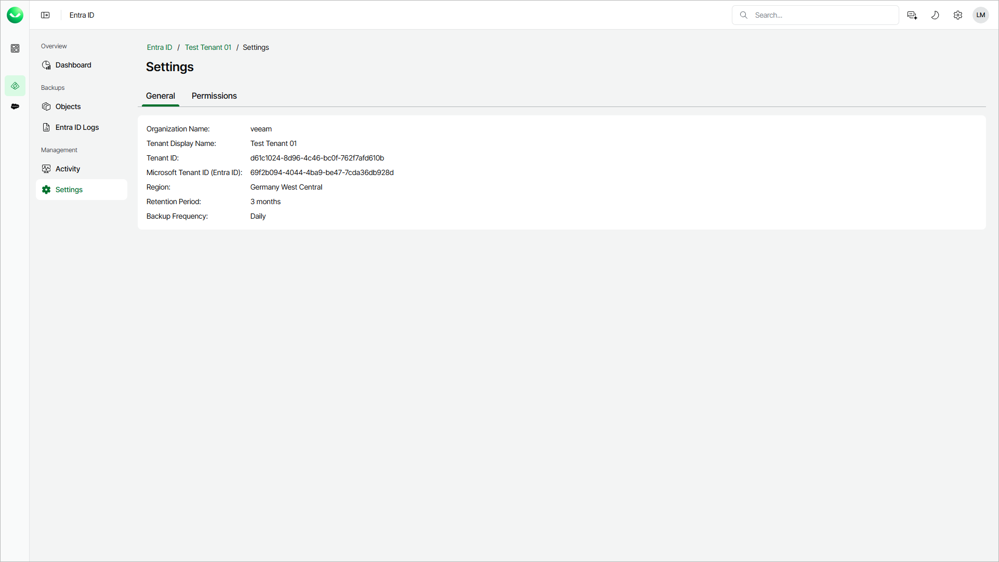

# Settings

In this article

The Veeam Data Cloud portal enables you to review general settings of the tenant and to include Conditional Access and Microsoft Intune policies in your Entra ID backup.

Viewing General Settings

To view the general settings of the tenant:

1. On the Entra ID page, click the name of the tenant you want to manage.
2. Select Settings.
3. Make sure that the General tab is selected.

Enabling Backup of Additional Objects

You can include Entra ID Conditional Access policies and Microsoft Intune policies in the backup. If you allow Veeam Data Cloud to back up these objects, Veeam Data Cloud will automatically assign required permissions to the Microsoft Entra service principal that enables Veeam Data Cloud to back up and restore your Entra ID objects and logs. For details on required permissions, see [Permissions](entra_id_permissions.md).

|  |
| --- |
| Note |
| The restore of additional objects is available only if you enable the backup of those objects first and Veeam Data Cloud completes an Entra ID backup with this option enabled. For details, see [Entra ID Conditional Access Policies Restore](entra_id_cap_restore.md) and [Restoring Entire Intune Policies](entra_id_restore_intune.md). |

To enable backup of additional objects, do the following:

1. On the Entra ID page, click the name of the tenant you want to manage.
2. Select Settings.
3. Select the Permissions tab.
4. Set the toggle next to the object type you want to back up to On.
5. Click Save to apply the changes.

Disabling Backup of Additional Objects

To disable the backup of additional objects, contact [Veeam Customer Support](https://my.veeam.com/my-cases).

Page updated 11/19/2025
