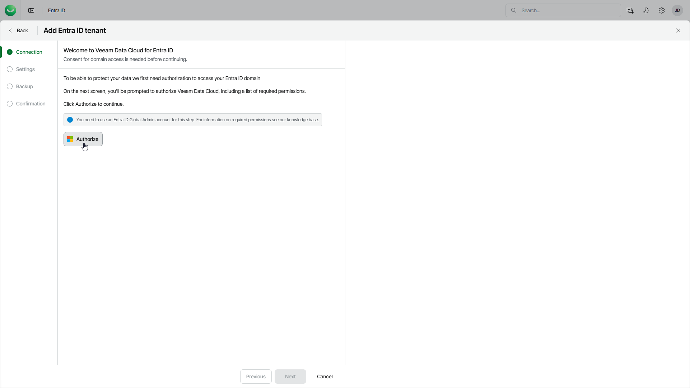

# Step 2. Authorize Access to Entra ID Domain

In this article

At the Connection step of the wizard, log in to your Microsoft 365 account to authorize Veeam Data Cloud to access your Microsoft Entra ID tenant. Before authorization, make sure your Veeam Data Cloud account has permissions that are required for adding, backing up and restoring of your tenant. For details, see [Permissions](entra_id_permissions.md).

After authorization, Veeam Data Cloud will create a Microsoft Entra ID service principal in your Microsoft Entra ID tenant. This service principal allows Veeam Data Cloud to back up and restore Entra ID objects and logs.

To authorize the access, click Authorize and log in to the Microsoft 365 account. Make sure to log in with the user account that has the Global Administrator role. For more information about this role, see [this Microsoft article](https://learn.microsoft.com/en-us/entra/identity/role-based-access-control/permissions-reference).

Page updated 8/19/2025
