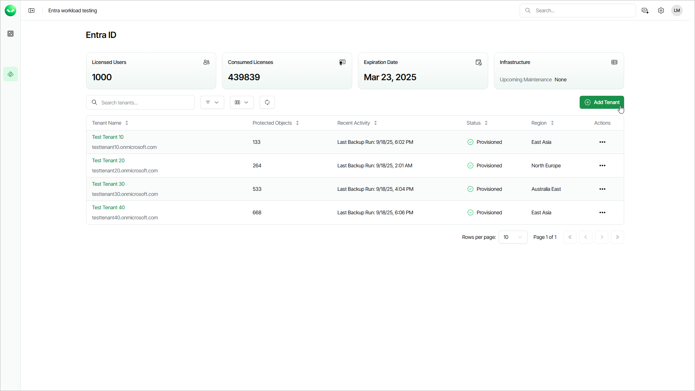

# Step 1. Launch Add Entra ID Tenant Wizard

In this article

To launch the Add Entra ID tenant wizard, do the following:

1. To open the list of Entra ID tenants, click Entra ID on the left.
2. Click Add Tenant.

|  |
| --- |
| Note |
| If you are a customer of a Veeam Cloud & Service Provider partner, you cannot launch the Add Entra ID tenant wizard. Ask your service provider to add your Entra ID tenant or send you an email with an invitation link that allows you to launch the wizard. |

Page updated 11/13/2025
