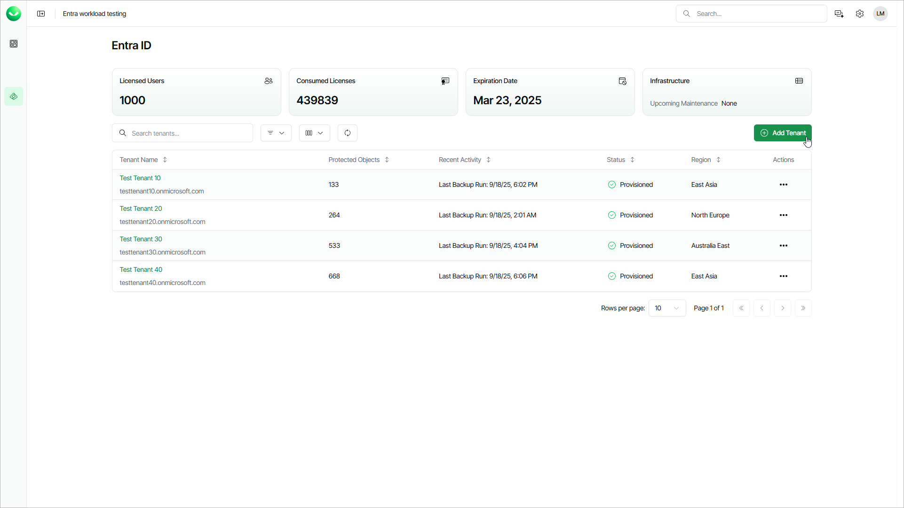

# Step 1. Launch Add Entra ID Tenant Wizard

To launch the Add Entra ID tenant wizard, do the following:

1. To open the list of Entra ID tenants, click Entra ID on the left.
2. Click Add Tenant.

Alternatively, if your service provider has invited you to add a new tenant, click the menu icon in the Actions column of your invitation and select Activate Invitation.

