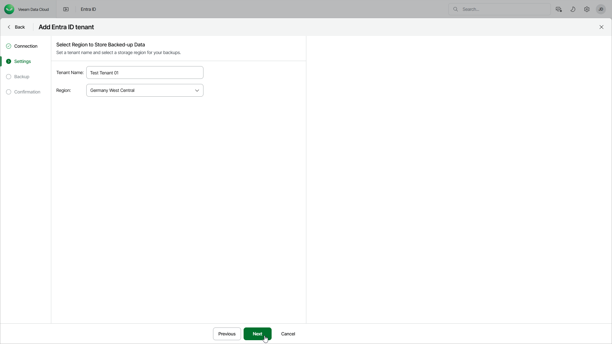

# Step 3. Specify Tenant Settings

In this article

At the Settings step of the wizard, specify a name for the new tenant and select a region where you want to store backed-up data. For information on supported Microsoft Azure regions, see [Backup Storage Regions](entra_id_regions.md).

Page updated 10/14/2025
