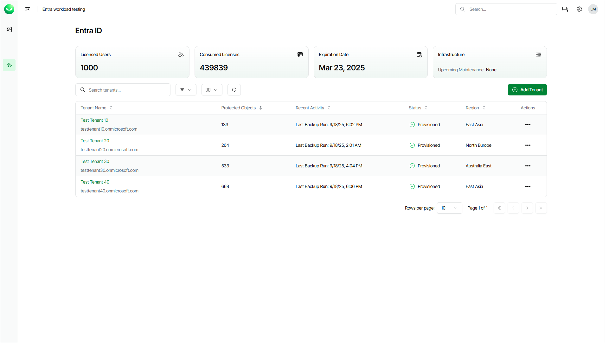

# Viewing Microsoft Entra ID Tenants

In this article

On the Entra ID page, you can view all added Entra ID tenants and information on the Veeam Data Cloud for Microsoft Entra ID subscription and Veeam Data Cloud maintenance. You can also add a new Entra ID tenant. For details on adding tenants, see [Adding Microsoft Entra ID Tenants](entra_id_tenant_add.md).

To view the Entra ID page, select Entra ID on the left.

In the upper section, Veeam Data Cloud displays the following information:

* The Licensed users field shows how many licenses are available in your subscription.
* The Consumed Licenses field shows how many licenses you are currently using. For details on Veeam Data Cloud for Microsoft Entra ID licensing, see [Licensing](entra_id_licensing.md).
* The Expiration Date field shows when your subscription will expire.
* The Infrastructure field provides information on the next planned maintenance date. To view all upcoming maintenance that can affect your Entra ID tenants, click See more.

Tenant Properties

In the tenant list, Veeam Data Cloud displays the following properties for each tenant:

| Property | Description |
| --- | --- |
| Tenant Name | Name that you specified when adding the tenant and the primary domain name of the Microsoft Entra ID tenant that this Veeam Data Cloud for Microsoft Entra ID tenant is connected to. |
| Protected Objects | Total number of Entra ID objects that Veeam Data Cloud backs up in this tenant. |
| Recent Activity | Date and time when Veeam Data Cloud finished the last successful backup of the tenant. |
| Status | Current state of the tenant. For details, see [Tenant Statuses](#tenantstatuses). |
| Region | Region where Veeam Data Cloud stores backed-up data. For information on supported Microsoft Azure regions, see [Backup Storage Regions](entra_id_regions.md). |

Tenant Statuses

Each Entra ID tenant can have one of the following statuses:

| Status | Description |
| --- | --- |
| Provisioning | Veeam Data Cloud is provisioning a new tenant after you finished the Add Entra ID tenant wizard. After the infrastructure for your tenant is ready, Veeam Data Cloud creates the initial backup of your Microsoft Entra ID tenant. |
| Provisioned | The infrastructure for your tenant is ready, and you can manage your tenant. With this status, tenant management may be temporarily unavailable due to the following reasons:   * The initial backup of your Entra ID tenant is in progress. You will receive an email notification once the initial backup is completed. * Planned maintenance is in progress. For details on Veeam Data Cloud planned maintenance, see [Veeam Data Cloud Maintenance](#vdcmaintenance). * You do not have permission to manage the tenant. To get the permission, an administrator of your Veeam Data Cloud organization must assign you the EntraID:Administrator role and add this tenant to the role scope. For details, see [Editing Users](users_edit.md). |
| Provisioning Failed | The infrastructure deployment or initialization of the backup policy was not successful. To resolve the issue, [submit a support case](https://my.veeam.com/my-cases). |
| Deprovisioning | Your subscription has expired and Veeam Data Cloud is suspending the backup policy in your tenant. After the backup policy is suspended, the tenant status changes to In Retention. |
| Deprovision Failed | Veeam Data Cloud was unable to suspend your backup policy. To resolve the issue, [submit a support case](https://my.veeam.com/my-cases). |
| In Retention | Your subscription has expired and Veeam Data Cloud suspended your backup policy for 30 days. During this period, you can renew your subscription, your existing Entra ID backups are still available, and you can use Veeam Data Cloud to restore your Entra ID data. If you do not renew your subscription within 30 days, Veeam Data Cloud will permanently delete your Entra ID tenant and all related data. |
| Reactivating | Veeam Data Cloud is activating the backup policy after you renewed your expired subscription within the retention period. After the backup policy is activated, the tenant status changes to Provisioned. |
| Reactivate Failed | Reactivation of the backup policy in your tenant was not successful. To resolve the issue, [submit a support case](https://my.veeam.com/my-cases). |
| Deleting | The retention period has expired, and Veeam Data Cloud is removing your tenant and all related data. |
| Delete Failed | Deletion of your tenant was not successful. To resolve the issue, [submit a support case](https://my.veeam.com/my-cases). |

Veeam Data Cloud Maintenance

Maintenance in Veeam Data Cloud involves various tasks that are designed to keep the services secure, updated and running smoothly. During the maintenance time, operations (backups, restores, adding tenants, policy changes and so on) within the affected regions may be suspended. Depending on the type of maintenance task, a short downtime may be expected. To keep track of scheduled maintenance, a plan of upcoming maintenance is available.

To view upcoming maintenance for your Entra ID tenants, select Entra ID on the left. The Infrastructure field provides information on the next planned maintenance date. To view all upcoming maintenance that can affect your Entra ID tenants, click See more.

Page updated 12/9/2025
