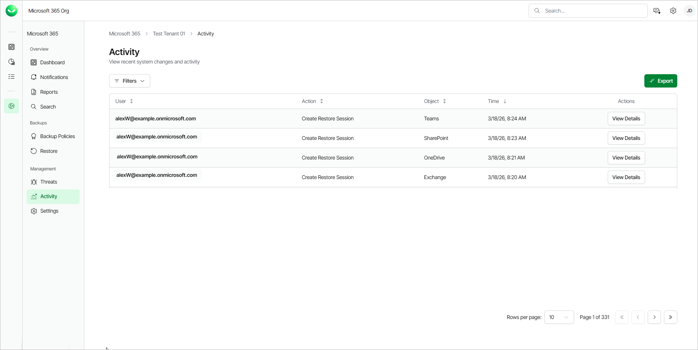

# Activity

This is a full overview of Veeam Data Cloud for Microsoft 365 user activity. For each action, you can also view a detailed action log.

In this section you can:

* Click Filters to filter the table by typing the email of a user or an object name (Outlook, OneDrive, SharePoint, and so on). You can also filter by selecting an action from the drop-down list and selecting the date from the calendar.
* Click View Details in the Actions column to view further details about the user activity.
* Click Export to download a .CSV file with user activity information. Select the day of activity you want to export and click Submit. The file is downloaded to your Downloads folder.

