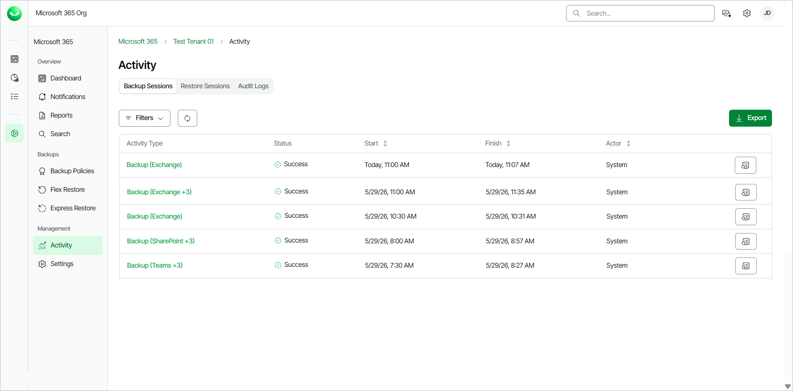
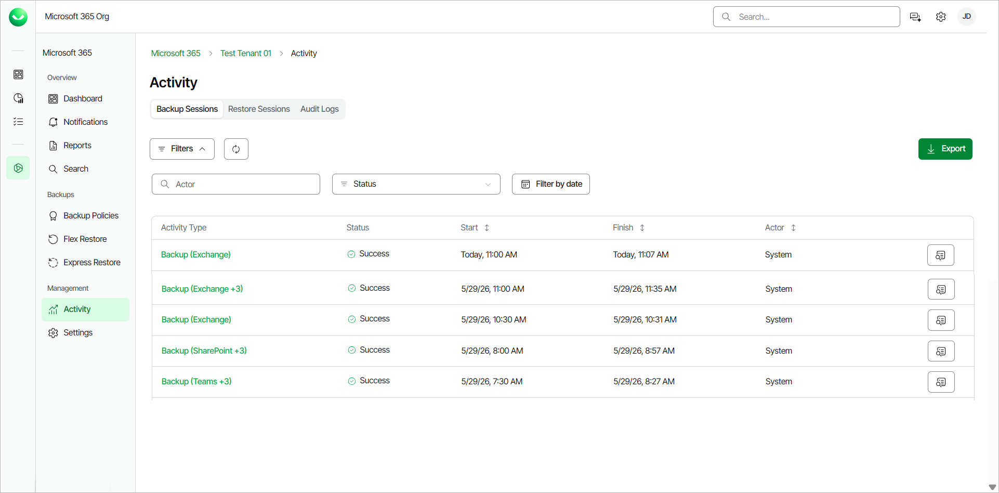
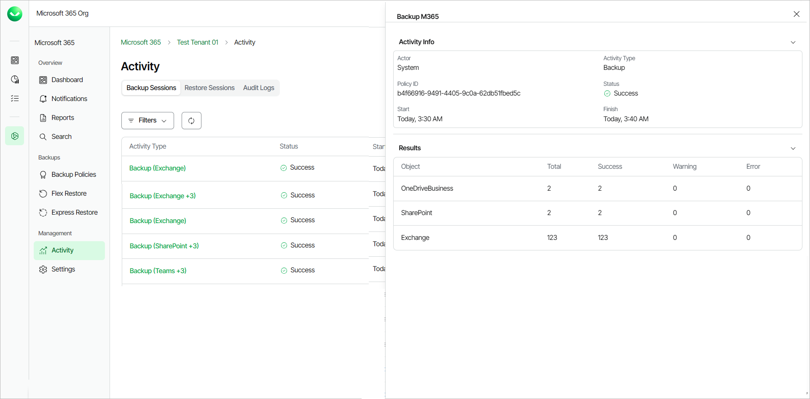

# Viewing Backup Sessions

For each Flex backup policy run, Veeam Data Cloud generates a new backup session. You can view all running and completed Flex-based backup policy sessions in the Activity page.

Only users with the OrganizationAdmin or M365:Administrator roles or a custom role with the View Activity Logs and View Backup Activity permissions can view the Backup Sessions tab in the Activity page of their tenant. For more information about roles, see [Roles](users_roles.md).

To view the list of Flex-based backup policy sessions, do the following:

1. On the Microsoft 365 page, click the name of the tenant you want to manage.
2. Select Activity.
3. Go to the Backup Sessions tab.

In the Backup Sessions tab, in the backup sessions list, Veeam Data Cloud displays the following information for each Flex-based backup session:

Viewing Backup Sessions

| Property | Description |
| Activity Type | Veeam Data Cloud displays the type of the activity as Backup (object type). If there are protected object types from different services: Backup (object type +{other object type number}).  For example, for a backup policy session that includes Exchange, OneDrive and Teams objects, the activity type will be Backup (Exchange +2). |
| Status | The status of the backup policy session. |
| Start | The date and time the backup policy session was started. |
| Finish | The date and time the backup policy session was completed. |
| Actor | The email address of the user that triggered the backup policy session. If the property value is System, the session was triggered automatically according to schedule. |

|  |
| --- |
| tip |
| You can click Export to download a .CSV file with the backup sessions activity information of the past 90 days. Select the date range of activity you want to export and click Submit. The file is downloaded to your Downloads folder. |

Filtering Data

You can search for specific backup sessions and apply filters to locate sessions with errors or warnings or filter by date. To apply a filter on the backup sessions list, in the Backup Sessions tab, click Filters. Then, you can do the following actions:

* To search for specific backup sessions, in the Actor search field, specify the full email address of the user who triggered the backup policy session.
* To filter by status, select one of the statuses from the Status drop-down list. The available statuses are the following: Success, Warning, Failed, Aborted, Started, Queued.
* To filter by a specific date, click Filter by date. Select a date range and click Apply.
* To remove the filters and view all backup sessions, click Clear Filters.

Viewing Details

To view the detailed information of a backup session, click View Details next to the backup session. In the Backup M365 window, Veeam Data Cloud displays the following information:

* In the Activity Info section, you can view the following details:

* Actor. The email address of the user that triggered the backup policy session. If the value is System, the session was triggered automatically according to schedule.
* Activity Type. The activity type is Backup.
* Policy ID. The ID of the backup policy.
* Status. The status of the backup policy session.
* Start. The date and time the backup policy session was started.
* Finish. The date and time the backup policy session was completed.

* In the Results section, you can view the following details about the items included in the backup policy session:

* Object. The service of the processed items. For example, Exchange, OneDrive, SharePoint, Teams.
* Total. The total number of processed items within the backup policy session.
* Success. The number of successfully processed items.
* Warning. The number of items that were successfully processed with warning messages.
* Error. The number of items that finished with errors.

