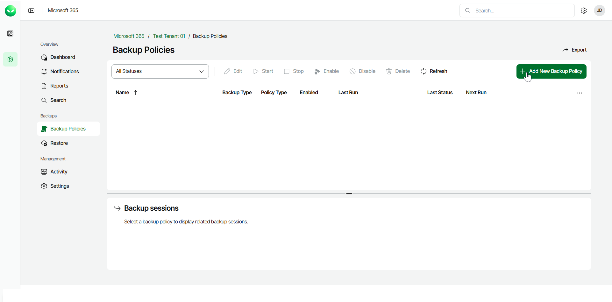
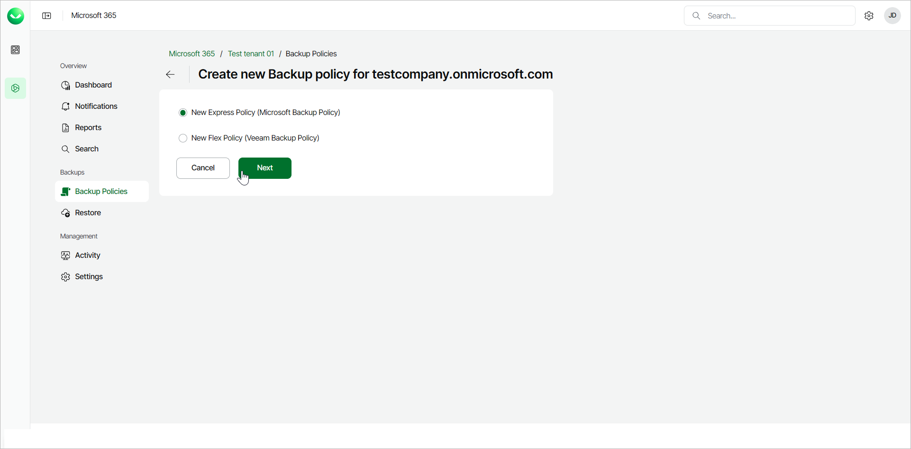
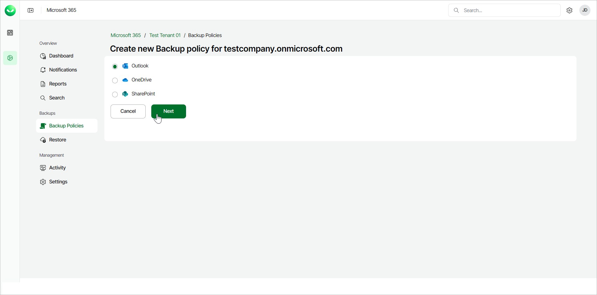
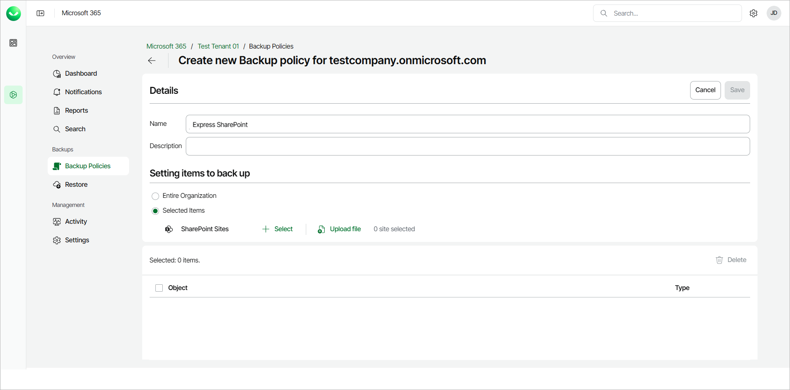

# Creating Express Backup Policies

To create Express backup policies, your organization must have an active Express or Premium Veeam Data Cloud for Microsoft 365 plan.

Consider the following:

* Veeam Data Cloud for Microsoft 365 supports the following types of Express backup policies:

* Selected Items backup policy
* Entire Organization backup policy

* You can only create one Entire Organization backup policy for each application (Outlook, OneDrive or SharePoint).
* You can create multiple Selected Items backup policies for each application (Outlook, OneDrive or SharePoint). Each specific object can only be protected with a single backup policy.
* Before you start creating backup policies, check [Considerations and Limitations](m365_considerations_limitations.md#backup).
* The schedule for Express backup policies depends on the protected Microsoft 365 service. For more information, see [Retention Period](m365_security.md#rpo).

To create new backup policies, do the following:

1. On the Microsoft 365 page, click the name of the tenant you want to manage.
2. Select Backup Policies.
3. On the Backup Policies page, click Add New Backup Policy.

1. Select New Express Policy and click Next.

1. Select the application whose items you want to back up: Outlook, OneDrive or SharePoint.

Keep in mind that there can only be one Express Entire Organization backup policy for each application type. If the backup policy already exists when you try to create a new one, Veeam Data Cloud for Microsoft 365 will offer you to edit the existing backup policy. Veeam Data Cloud for Microsoft 365 will display the following message: You already have a policy for Exchange/OneDrive/SharePoint. Click Next below to edit it. You can then proceed with editing the existing backup policy.

If the existing backup policy is disabled when you try to create a new one, Veeam Data Cloud for Microsoft 365 will instruct you to enable the existing backup policy. Veeam Data Cloud for Microsoft 365 will display the following message: Your Exchange/OneDrive/SharePoint backup policy is currently disabled. You will need to enable it before you can edit it. Once you enable the backup policy, you can proceed with editing it. To learn more, see [Editing Express Backup Policies](m365_backup_edit_express.md).

1. Click Next.
2. In the Details section, in the Name field, specify a name for the new backup policy.
3. [Optional] In the Description field, provide a description for future reference.
4. In the Setting items to back up section, choose Entire Organization or Selected Items.

If you back up the entire organization, when the backup policy runs, it checks the entire content of the organization and the list of items to back up is automatically updated. For example, if some users were added or deleted from the organization between backup policy runs, the backup policy reflects those changes.

1. [For selected items backup policies] For Outlook and OneDrive, click Select next to Microsoft 365 Users or Groups and choose specific objects to back up. For SharePoint, click Select next to SharePoint Sites and choose specific objects to back up.

For SharePoint, you can also click Upload file to upload a CSV file with one SharePoint site URL per line.

1. Click Save to create the new Express backup policy.

