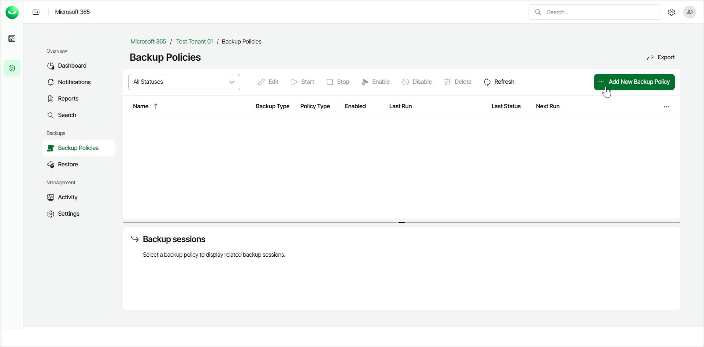

# Step 1. Launch New Backup Policy Wizard

In this article

To launch the New Backup Policy wizard, do the following:

1. On the Microsoft 365 page, click the name of the tenant you want to manage.
2. Select Backup Policies.
3. On the Backup Policies page, click Add New Backup Policy.

Page updated 9/19/2025
