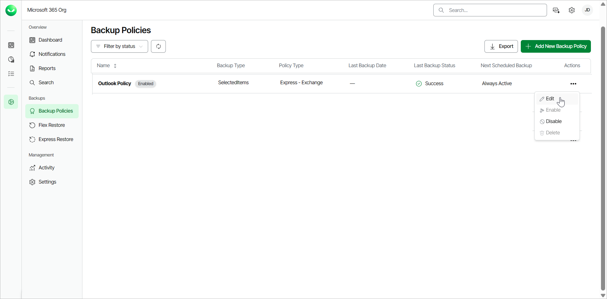
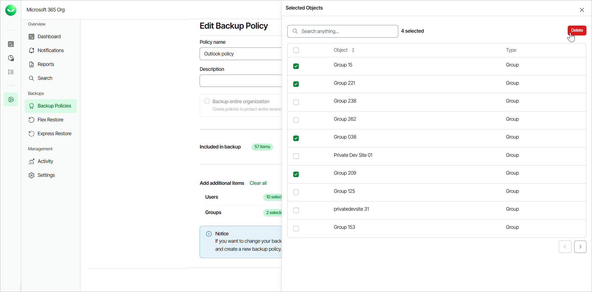
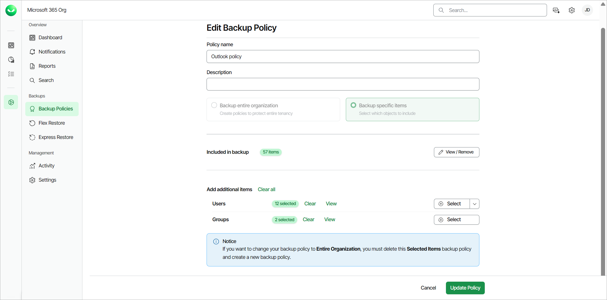

# Editing Express Backup Policies

You can add and remove users and objects to and from Express backup policies created in Veeam Data Cloud for Microsoft 365.

Consider the following:

Veeam Data Cloud for Microsoft 365 supports the following types of Express backup policies:

* Entire organization backup policy
* Specific items backup policy

If you back up the entire organization, when the backup policy session starts, Veeam Data Cloud checks the entire content of the organization and the list of items to back up is automatically updated. For example, if some users were added or deleted from the organization between backup policy runs, the backup policy reflects those changes. For this reason, you cannot edit items in an entire organization backup policy. You can only edit the name and description of the backup policy. If you want to be able to add or remove items, you must delete the entire organization backup policy and create a specific items backup policy.

In contrast, a specific items backup policy only backs up the items you specify. New items are not automatically added between backup policy runs. You need to keep track of what you want to back up and edit the list of objects added to such policies. You can also edit the name and description of the backup policy.

To edit an Express backup policy, do the following:

1. On the Microsoft 365 page, click the name of the tenant you want to manage.

1. Select Backup Policies.
2. On the Backup Policies page, in the Actions column of the backup policy you want to edit, click Edit.

1. On the Edit Backup Policy page, in the Policy name field, you can specify a different name for the backup policy.
2. In the Description field, you can modify or provide a description for future reference.
3. For specific items backup policies, you can do the following:

* In the Included in backup section, click View/Remove to view or modify the objects currently included in the backup policy. To remove any of the objects, in the Selected Objects window, select the check boxes next to them and click Delete.

* In the Add additional items section, for Outlook and OneDrive, click Select next to Users or Groups and select specific objects to add to the backup. For Users, you can also click Upload a CSV file to upload a .CSV or text file with one email address per line.

For SharePoint, click Select next to SharePoint Sites and select specific objects to add to the backup. You can also click Upload a CSV file to upload a .CSV file with one SharePoint site URL per line.

1. Click Update Policy to complete the operation.

