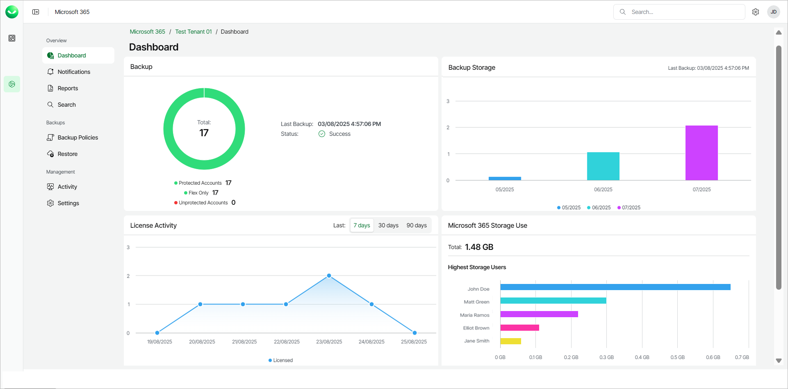

# Viewing Dashboard

The Veeam Data Cloud for Microsoft 365 dashboard contains information on the state of backups, users and licenses, as well as information about user activity.

To view the Veeam Data Cloud for Microsoft 365 dashboard, do the following:

1. On the Microsoft 365 page, click the name of the tenant you want to manage.
2. The dashboard is the landing page when you open a tenant. To return to the dashboard from a different page, click Dashboard.

The Dashboard page displays the following sections:

* The Backup section displays information about the date, time and status of the last backup. The section also provides the following information about the Microsoft 365 user accounts in the organization:

* Protected Accounts. The total number of accounts whose data is being backed up. This total includes shared mailboxes, resource mailboxes, group mailboxes and public folder mailboxes that have a Microsoft 365 license assigned.
* Express Only. The total number of Express licenses consumed. This is visible only when Express licenses are consumed.
* Premium. The total number of Premium licenses consumed. This is visible only when Premium licenses are consumed.
* Flex Only. The total number of Flex licenses consumed.
* No License Required. The total number of accounts without a valid Microsoft 365 license assigned, whose data is not being backed up.
* Unprotected Accounts. The total number of accounts whose data is not being backed up.

|  |
| --- |
| note |
| Veeam Data Cloud calculates the number of unprotected accounts according to the following rules. During the initial backup session, Veeam Data Cloud creates the first restore point that contains all objects included in the backup policy. During subsequent backup sessions, Veeam Data Cloud creates restore points that contain objects for which a new version appeared in Microsoft 365 since the previous backup session. If a restore point that contains the object has not been created within the last 31 days, the object will be considered an unprotected account. For more information, see [Backup Retention](m365_data_backup.md#retention) and [License Consumption](m365_licensing.md#consumption). |

* The Backup Storage section provides information about the total storage used by all the backups each month.
* The License Activity section provides information about active and inactive users from the Microsoft 365 tenancy in the last 7, 30 or 90 days. Active and inactive users both consume Microsoft 365 licenses, however, inactive users are users who have not used any Microsoft 365 apps during the specified period.
* The Microsoft 365 Storage Use section provides information about the 5 users who consume the most storage and the total size of used Microsoft 365 storage. Microsoft 365 storage includes the total storage of mailboxes, OneDrive for Business and SharePoint.

|  |
| --- |
| tip |
| If the Microsoft 365 Storage Use section shows GUIDs instead of the names of the users, the Microsoft 365 Global Administrator can disable the Display concealed user, group and site names in all reports setting in the Microsoft 365 admin center. For details, see [this Microsoft article](https://learn.microsoft.com/en-us/microsoft-365/troubleshoot/miscellaneous/reports-show-anonymous-user-name#resolution). |

* In the Recent User Activity section, you can view information about actions that Veeam Data Cloud for Microsoft 365 users took and the date and time of those actions. In this section you can:

* Click Refresh to refresh the view with the latest information.

* Click View All Activity for a full overview of Veeam Data Cloud for Microsoft 365 user activity. For more information, see [Activity](m365_activity.md).

