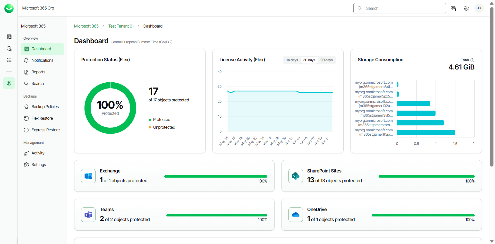

# Viewing Dashboard

The Veeam Data Cloud for Microsoft 365 dashboard contains information on the state of backups, users and licenses, as well as information about user activity.

To view the Veeam Data Cloud for Microsoft 365 dashboard, do the following:

1. On the Microsoft 365 page, click the name of the tenant you want to manage.
2. The dashboard is the landing page when you open a tenant. To return to the dashboard from a different page, click Dashboard.

The content on the Dashboard page is only visible to users with the OrganizationAdmin or M365:Administrator roles or a custom role with the View Activity Logs, View Licensing Dashboard and View Backups permissions. For more information about roles, see [Roles](users_roles.md).

The Dashboard page displays the following sections:

* The M365 Backup Coverage section displays the protection status of your workload tenant objects. The protection status is represented as the ratio of protected objects to the total number of objects included in Veeam Data Cloud Flex backup policies. Veeam Data Cloud calculates the total number of objects from the Objects Protection section.
* The Objects Protection section displays the number of Microsoft Exchange Online, Microsoft SharePoint Online, Microsoft Teams and Microsoft OneDrive for Business objects that are protected within scheduled Flex-based backup policies (not manually triggered backup policies) for each service. An object is the smallest unit available for backup. For example, a mailbox, site or OneDrive. An object is considered protected if a restore point was created within the Recovery Point Objective (RPO) defined by the Flex backup policy schedule assigned to this object.

Consider the following:

* Only the services you chose to protect when [you added the Microsoft 365 tenant to Veeam Data Cloud](m365_tenant_add.md#auto) will be visible in the section.
* If the tenant has no completed backup policies, each service will display the No backup policy assigned message. Click Assign Policy to go to the Backup Policies page where you can create new backup policies. For more information, see [Creating Flex Backup Policies](m365_backup_create_flex.md).
* If a backup policy is running, the number of protected objects for each service within that backup policy will be 0.
* When a backup policy completes successfully, Veeam Data Cloud updates the Objects Protection section to display the number of protected objects and the progress percentage in each service.
* If one object is protected in multiple backup policies, Veeam Data Cloud will count it multiple times in the Objects Protection section.

* The License Activity section displays daily usage data for Veeam Data Cloud Foundation and Advanced license consumption in the tenant, in the last 14, 30 (default) or 90 days.
* The Storage Consumption section displays the Veeam Data Cloud for Microsoft 365 storage consumption for each storage repository you use on the tenant.

* In the Recent User Activities section, you can view information about the actions the last 5 Veeam Data Cloud for Microsoft 365 users took and the date and time of those actions. Click View All Activities for a full overview of Veeam Data Cloud for Microsoft 365 user activity. For more information, see [Activity](m365_activity.md).

