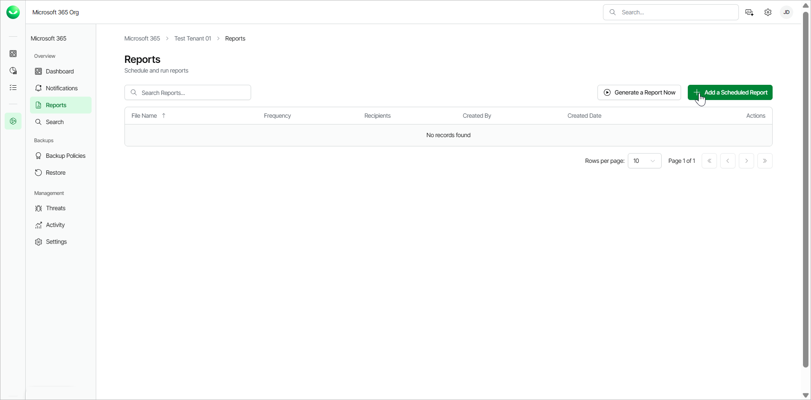
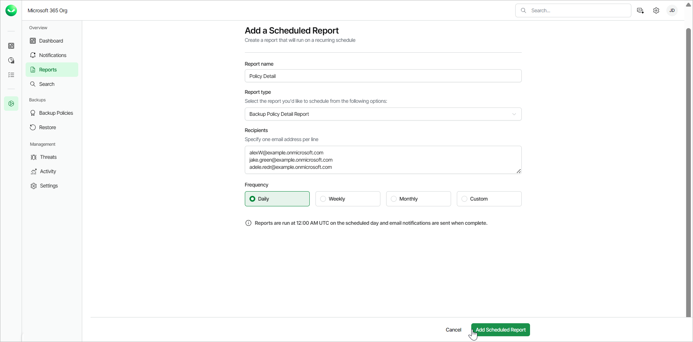

# Scheduling Reports

You can schedule reports in Veeam Data Cloud for Microsoft 365. When you schedule a report, you specify the frequency and email recipients. Once a scheduled report runs, the recipients receive an email from Veeam Data Cloud for Microsoft 365 with a link to download the report. The report is valid for 7 days.

To schedule a report, do the following:

1. On the Microsoft 365 page, click the name of the tenant you want to manage.
2. Select Reports.
3. Click Add a Scheduled Report.

1. In the Report name field, type a name for the new scheduled report.
2. From the Report type drop-down list, select the report you want to schedule. The available reports are the following:

* Backup Policy Detail Report. This report lists policy names, start and end times, policy type, status, processed objects and summary.
* Backup Summary Report. This report lists policy names, last status, last restore point, number of successful runs, failures, warnings, objects processed, data transferred (GiB) and a total row with object counts.
* Mailbox Protection Report. This report lists mailboxes with their protection status, last backup date, owner email and organization.
* OneDrive Protection Report. This reports lists OneDrives with their protection status, last backup date, URL and organization.
* Restore Activity Report. This report lists session types, initiating user email, action, object, date and items processed in the restore session.
* SharePoint Protection Report. This report lists sites with their protection status, last backup date, URL and organization.
* Teams Protection Report. This report lists teams with their protection status, last backup date and organization.
* User Protection Report. This report lists usernames with their protection status, last backup date, emails and organization.

1. In the Recipients field, specify the email addresses of the report recipients. Use one line for one email address. Your own email address is added by default. The specified users will receive an email from Veeam Data Cloud for Microsoft 365 with a link to Veeam Data Cloud to download the report. The report is valid for 7 days.

|  |
| --- |
| TIP |
| * You can also specify email addresses outside of your organization. The recipients must be able to log in to Veeam Data Cloud for Microsoft 365 to download the reports. * To receive the scheduled report email, make sure to include no-reply@mail.cloud.veeam.com in your allowed, approved or safe senders list in your email client. |

1. In the the Frequency section, select whether to receive the scheduled report daily, weekly, monthly or create a custom frequency.

* Daily. The report will run every day.
* Weekly. The report will run every week. From the Day of the week drop-down, select which day of the week you want to receive the report.
* Monthly. The report will run every month. In the Select day section, choose one of the following:

* Day of the week. Select which day of the month you want to receive the report. For example, when you select First Monday, you will receive the report on the first Monday of the month.
* Calendar date. Select the day of the month from the 1st to the 31st from the drop-down list.

* Custom. Select the check box next to the month and day you want to receive the report.

1. Click Add Scheduled Report.

