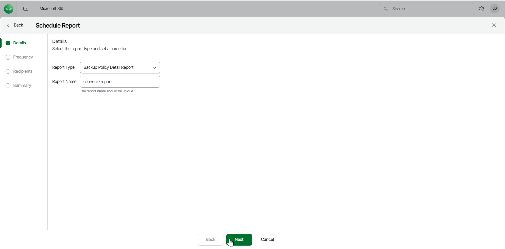

# Step 2. Specify Report Details

At the Details step of the wizard, select the type of report you want to schedule and specify a name for the report.

1. From the Report Type drop-down list, select the report you want to schedule. The available reports are the following:

* Mailbox Protection Report
* User Protection Report
* Backup Summary Report
* Restore Activity Report
* Backup Policy Detail Report

1. In the Report Name field, type a name for the new scheduled report.
2. Click Next.

