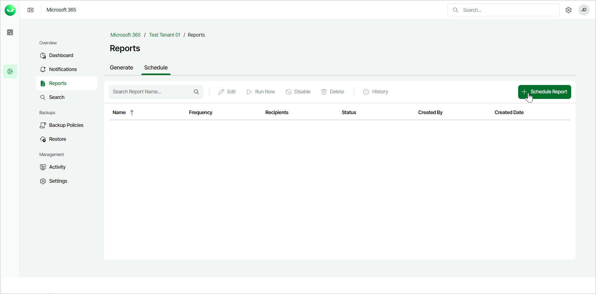

# Step 1. Launch Schedule Report Wizard

To schedule a report, use the Schedule Report wizard.

1. On the Microsoft 365 page, click the name of the tenant you want to manage.
2. Select Reports.
3. In the Schedule tab, click Schedule Report.

