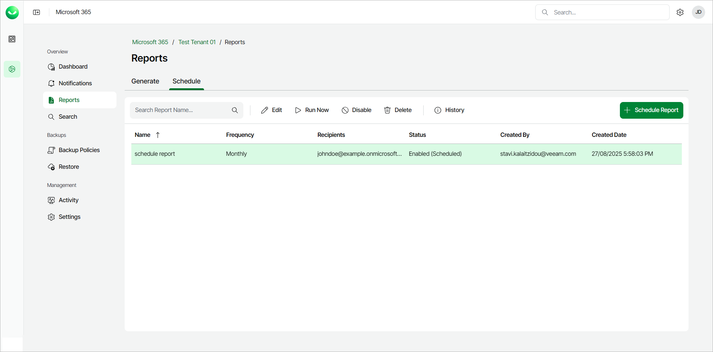
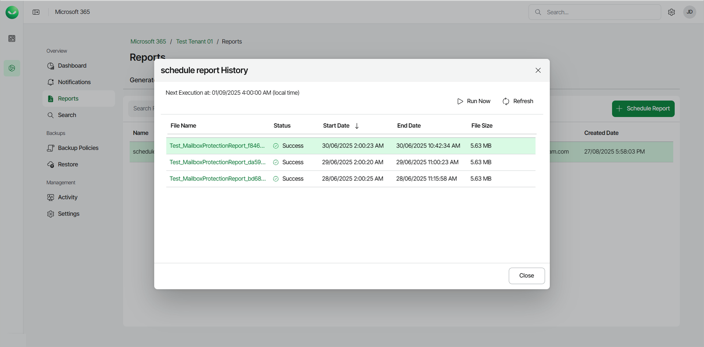

# Managing Scheduled Reports

In this article

In Reports, in the Schedule tab, you can see a list of all the scheduled reports with information about the name, frequency, recipients, status, who created the report, and the date it was created.

To manage a scheduled report, select the report you want to manage and do the following:

* Click Edit to update the details, frequency and recipients of the scheduled report.
* Click Run Now to run the scheduled report now.
* Click Disable (or Enable if the report is disabled) to disable (or enable) the scheduled report.
* Click Delete to delete the scheduled report.
* Click History to see an overview of the report execution. In the overview, you can do the following:

* Click Run Now to run the scheduled report.
* Click Refresh to refresh the overview.
* Under File Name, click the link of an executed report to download the report.

The history overview also displays the following information:

* The date and time of the next scheduled execution
* The file name of the executed report
* The status of the executed report
* The start and end date and time of the executed report
* The file size of the executed report

Page updated 9/15/2025
