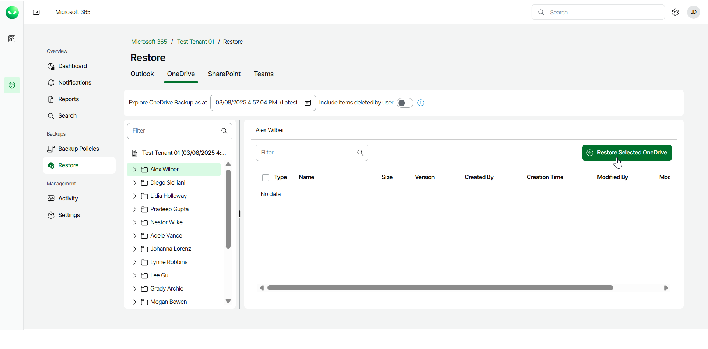
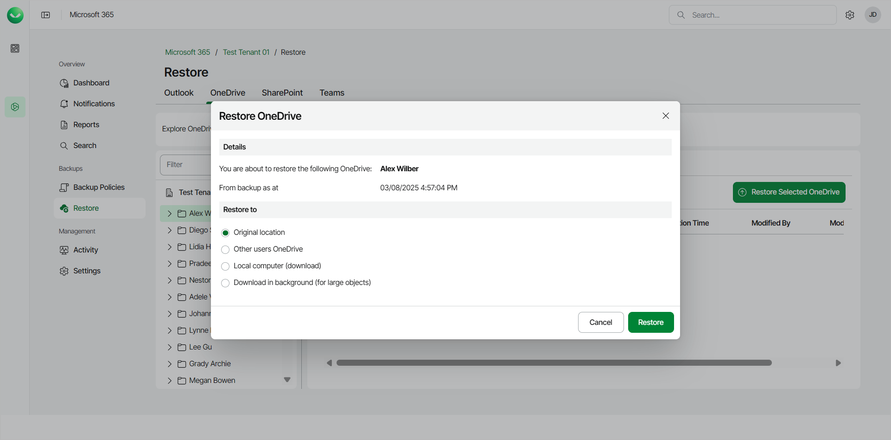
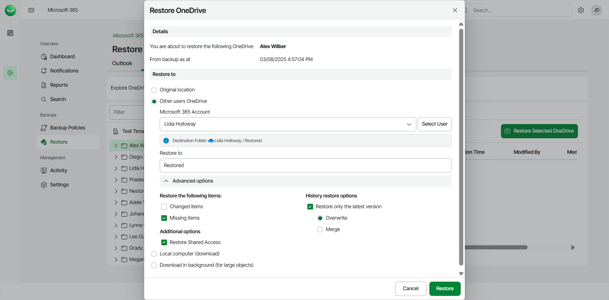
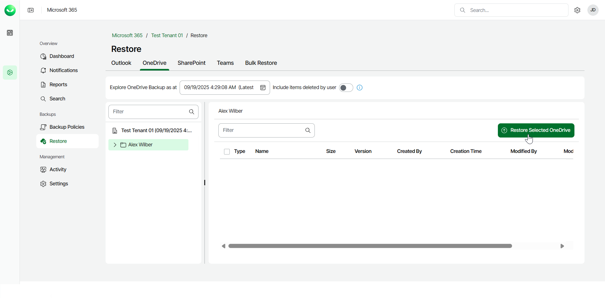
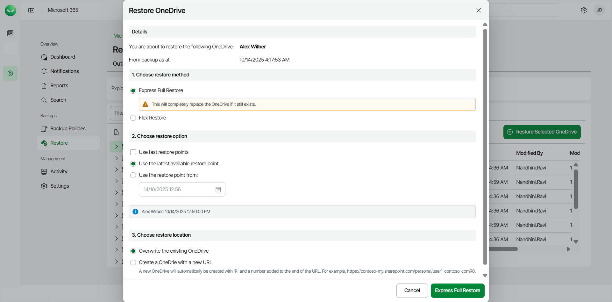

# Restoring Entire OneDrive

In this article

Veeam Data Cloud for Microsoft 365 offers 2 restore methods for restore of entire OneDrive: Flex Restore and Express Full Restore.

The restore method options available to you depend on what backup policy type covers the Microsoft 365 user whose data you restore. The backup policy type defines the plan of the backed-up user. To learn more about plans in Veeam Data Cloud for Microsoft 365, see [Plans](m365_licensing.md#plans).

Before you start performing restore, check [Considerations and Limitations](m365_considerations_limitations.md#restore).

Flex Restore

To restore an entire OneDrive from the backup:

1. On the Microsoft 365 page, click the name of the tenant you want to manage.
2. Select Restore.
3. On the OneDrive tab, select the user whose OneDrive you want to restore.

To restore multiple OneDrives, click on your organization and then select the check boxes next to the users whose OneDrives you want to restore. You can restore multiple OneDrives only to the original location.

1. By default, Veeam Data Cloud for Microsoft 365 uses the latest available restore point for data restore. If you want to select another restore point, in the Explore OneDrive Backup as at field, click the calendar icon and select the date and time when the necessary restore point was created.
2. Click Restore Selected OneDrive.

1. In the Restore to section, select where to restore OneDrive. You can select one of the following options:

* Original location. Select this option if you want to restore OneDrive to its original location.
* Other users OneDrive. Select this option if you want to restore OneDrive to OneDrive of another Microsoft 365 user.

If you select this option, do the following:

1. In the Microsoft 365 Account field, click Select User and select the necessary user account in the User selection window.
2. In the Restore to field, type the name of the folder where to restore OneDrive. Veeam Data Cloud for Microsoft 365 will display the resulting path to the restore destination.

You can also use the Advanced options toggle to display more options. For details, see the next step of the procedure.

* Local computer. Select this option if you want to download the OneDrive content to your computer. Use this option for OneDrive whose size does not exceed 1 GB. Veeam Data Cloud will save the OneDrive content to a .ZIP file.

* Download in background. Select this option if you want to download the OneDrive content to your computer. Use this option for OneDrive whose size exceeds 1 GB or if the download process takes more than 3.5 minutes. Veeam Data Cloud will save the OneDrive content to a .ZIP file. For more information on how to get the downloaded data, see [Obtaining Downloaded Items](m365_obtain_downloaded_items.md).

1. [For restore to OneDrive of another user account] If you want to specify advanced restore options, do the following:

1. Click Advanced options.
2. In the Restore the following items section, do the following:

1. Select the Changed items check box if you want to restore items that have been modified in the production environment.
2. Select the Missing items check box if you want to restore items that are missing in your target location. For example, some of the items were removed and you want to restore them from the backup.

1. In the History restore options section, select the Restore only the latest version check box if you want to restore only the latest version of items. If you select this check box, you can select one of the following options:

* Overwrite. Select this option to overwrite items in the production environment with the latest version of items in the backup.
* Merge. Select this option to merge the latest version of items in the backup into items in the production environment.

1. In the Additional options section, select the Restore Shared Access check box if you want to restore shared access permissions of the restored OneDrive content.

1. Start the restore process:

* Click Restore if you chose to restore data to the original location or another user account.
* Click Download if you chose to download data to the local computer or download data in the background.

Express Full Restore

To restore an entire OneDrive from the backup:

1. On the Microsoft 365 page, click the name of the tenant you want to manage.
2. Select Restore.
3. On the OneDrive tab, select the user whose OneDrive you want to restore.

To restore multiple OneDrives, click on your organization and then select the check boxes next to the users whose OneDrives you want to restore. You can restore multiple OneDrives only to the original location.

1. Click Restore Selected OneDrive.

1. In the Restore OneDrive window, in the Choose restore method section, select Express Full Restore.
2. In the Choose restore option section, select the restore point from which you want to restore OneDrive. You can select one of the following options:

* Use the latest available restore point. If you select this option, Veeam Data Cloud for Microsoft 365 will restore data from the latest restore point of the backup.

* Use the restore point from. If you select this option, you can select the date and time when the necessary restore point was created. Veeam Data Cloud for Microsoft 365 will restore data from this restore point.

Select the Use fast restore points check box if you want to select from the fastest available restore points created by Express backup policies.

1. In the Choose restore location section, select where you want to restore the data. You can select one of the following options:

* Overwrite existing Onedrive. Select this option to replace data in the original location with the data from the backup.
* Create a OneDrive with a new URL. Select this option to restore the data to a new location. Veeam Data Cloud restores the data to a newly created OneDrive with an R and a number added to the end of the URL. For example, https://contoso-my.sharepoint.com/personal/user1\_contoso\_comR0.

1. Click Express Full Restore to start the restore process.

Page updated 10/14/2025
