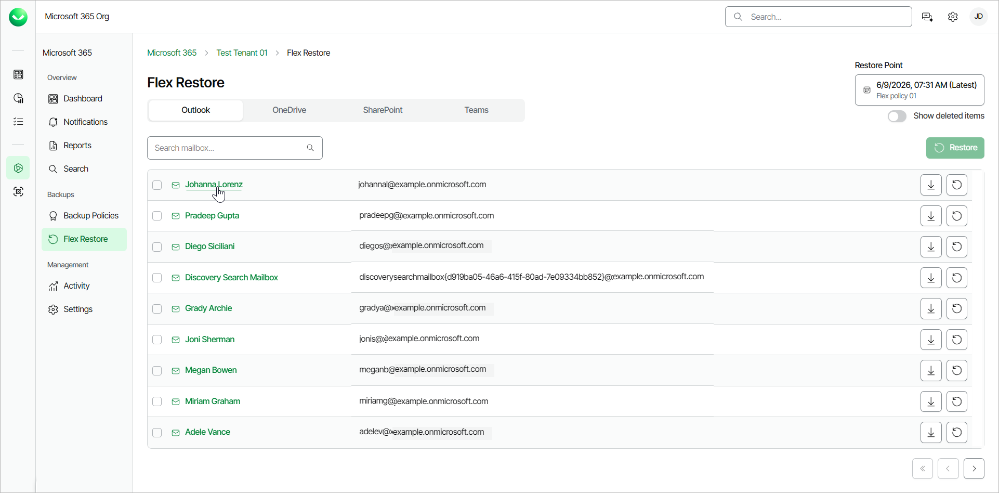
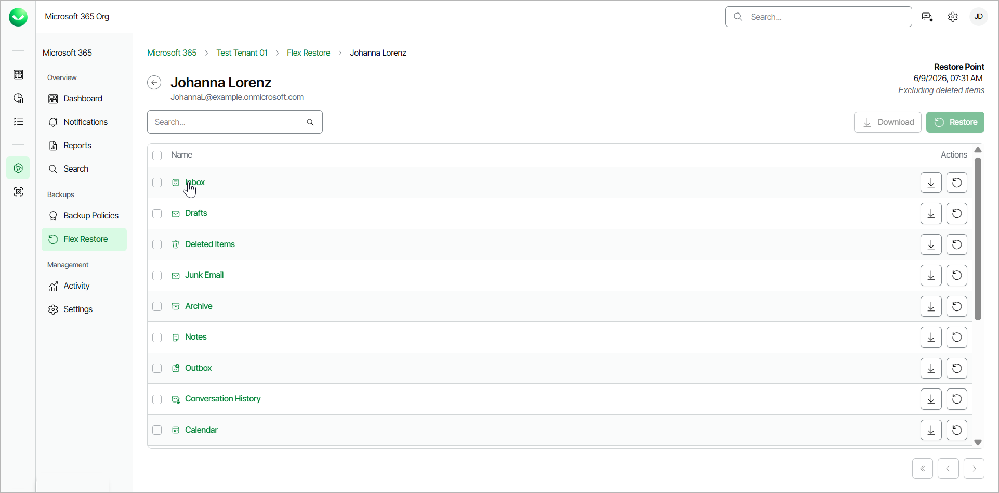
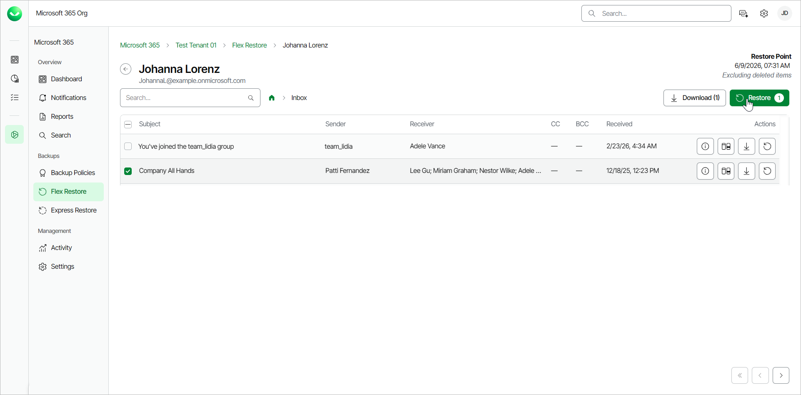
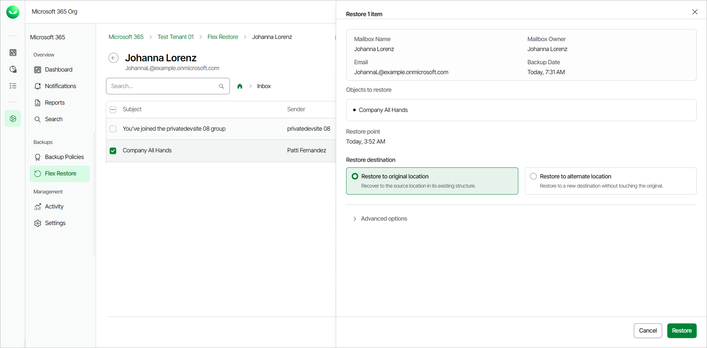
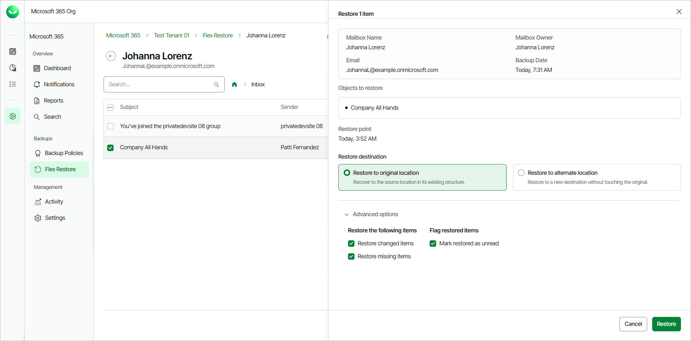

# Restoring Outlook Items

Before you start performing restore, check [Considerations and Limitations](m365_considerations_limitations.md#restore).

To restore a specific item within a folder of a mailbox:

1. On the Microsoft 365 page, click the name of the tenant you want to manage.
2. Select Flex Restore.
3. By default, Veeam Data Cloud uses the latest available restore point for data restore. If you want to select another restore point, click on the  Restore Point information box. On the calendar, select the date and time when the necessary restore point was created and click Apply.
4. Click the name of the mailbox that contains the item you want to restore.

1. Click on the folder that contains the item you want to restore.

1. Select the check box next to the necessary email in the list of items. You can select multiple emails.
2. Click Restore.

1. In the Restore item window, you can check the name of the item you want to restore, the time when the backup that contains the item was created and the selected restore point.
2. In the Restore destination section, select where to restore the item. You can select one of the following options:

* Restore to original location. Select this option if you want to restore the item to its original location.

If you select this option, you can use the Advanced options toggle to display more options.

* Restore to alternate location. Select this option if you want to restore the item to another mailbox.

If you select this option, in the Organization member and Target folder path fields specify the address of the target mailbox and the target mailbox folder.

For multi-geo tenants, the target mailbox must belong to the same protected regions as the current tenant.

You can also click Advanced options to display more options.

1. [Optional] In the Restore reason section, specify a reason for the restore.
2. If you want to specify advanced restore options, do the following:

1. Click the Advanced options toggle.
2. In the Restore the following items section, do the following:

1. Select the Restore changed items check box if you want to restore items that were changed.
2. Select the Restore missing items check box if you want to restore items that are missing in your target location. For example, some of the items were removed and you want to restore them from the backup.

1. In the Flag restored items section, select the Mark restored as unread check box if you want to mark each restored item as unread.

1. Click Restore to start the restore process.

|  |
| --- |
| TIP |
| Consider the following:   * You can download mailbox items to your computer. To do that, select the check box next to the item you want to download and click Download. Veeam Data Cloud for Microsoft 365 will save the mailbox item to an .MSG file. For more information on how to get the downloaded data, see [Obtaining Downloaded Items](m365_obtain_downloaded_items.md). * Restored items appear in an Outlook mailbox based on the received date, not the restore date. |

