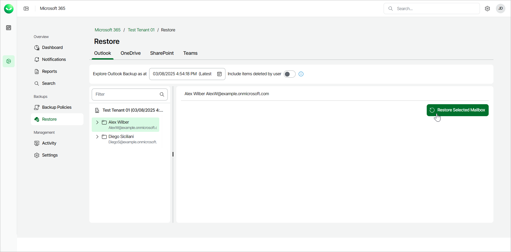
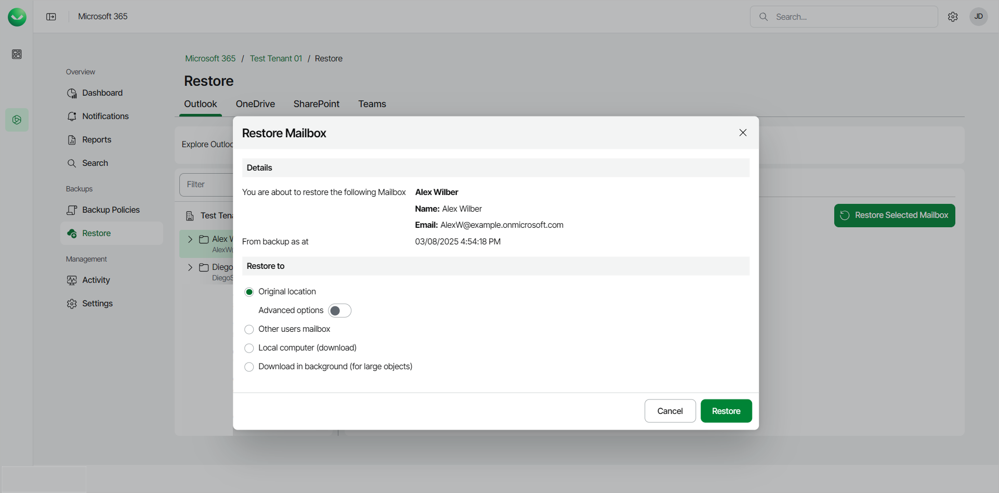
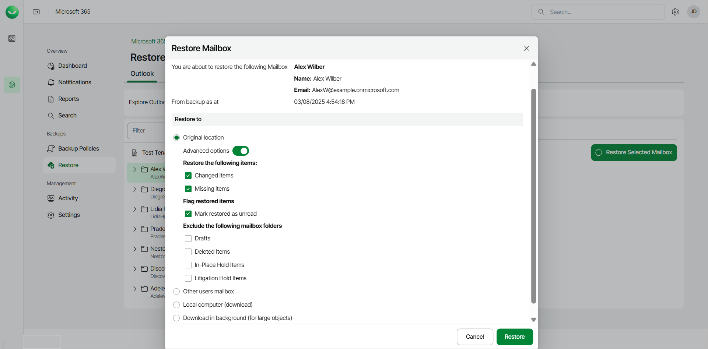
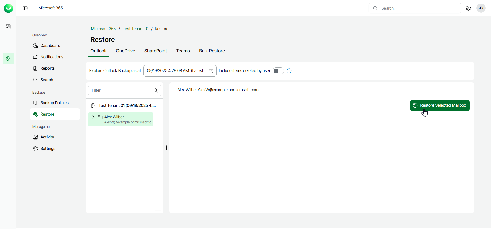
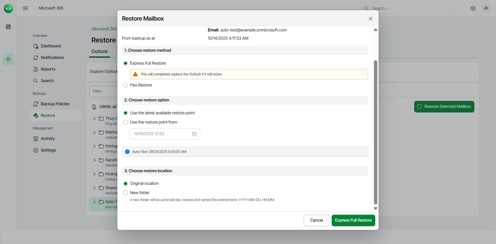
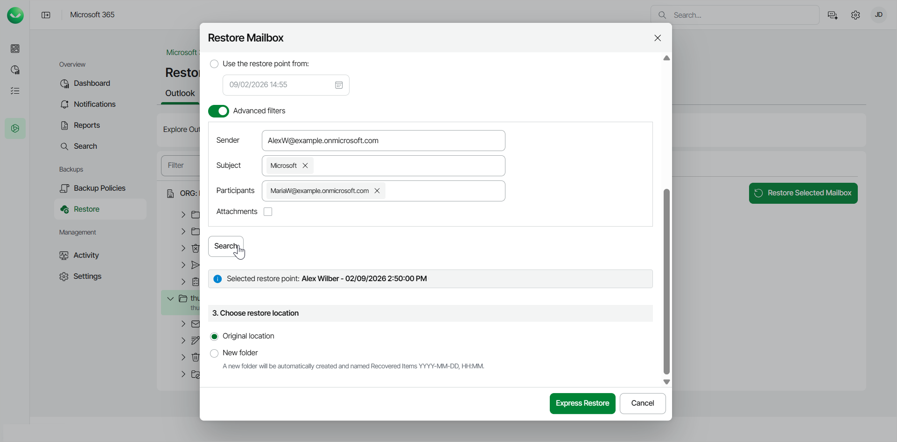
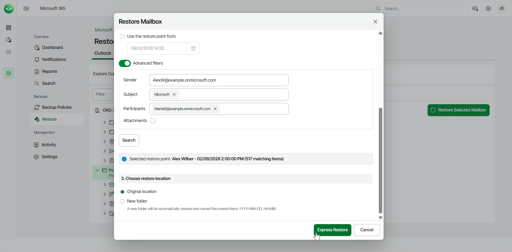

# Restoring Outlook Mailboxes

Veeam Data Cloud for Microsoft 365 offers 2 restore methods for restore of Microsoft Outlook mailboxes: Flex Restore and Express Restore.

The restore method options available to you depend on what backup policy type covers the Microsoft 365 user whose data you restore. The backup policy type defines the plan of the backed-up user. To learn more about plans in Veeam Data Cloud for Microsoft 365, see [Plans](m365_licensing.md#plans).

Before you start performing restore, check [Considerations and Limitations](m365_considerations_limitations.md#restore).

Flex Restore

To restore an entire Microsoft Outlook mailbox from the backup:

1. On the Microsoft 365 page, click the name of the tenant you want to manage.
2. Select Restore.
3. By default, Veeam Data Cloud uses the latest available restore point for data restore. If you want to select another restore point, in the Explore Outlook Backup as at field, click the calendar icon and select the date and time when the necessary restore point was created.
4. Select the mailbox you want to restore.

To restore multiple mailboxes, click on your organization and then select the check boxes next to the mailboxes you want to restore. You can restore multiple mailboxes only to the original location.

1. Click Restore Selected Mailbox.

1. In the Restore to section, select where to restore the mailbox. You can select one of the following options:

* Original location. Select this option if you want to restore the mailbox to its original location.

If you select this option, you can use the Advanced options toggle to display more options. For details, see the next step of the procedure.

* Other users mailbox. Select this option if you want to restore the mailbox to another mailbox.

If you select this option, in the Mailbox and Folder fields specify the address of the target mailbox and the target mailbox folder. You can also click Advanced options to display more options. For details, see the next step of the procedure.

* Download in background. Select this option if you want to download the mailbox content to your computer. Veeam Data Cloud for Microsoft 365 will save the mailbox content to a .PST file. For more information on how to get the downloaded data, see [Obtaining Downloaded Items](m365_obtain_downloaded_items.md).

|  |
| --- |
| tip |
| If you download a large mailbox, Veeam Data Cloud for Microsoft 365 will split the data into smaller .PST files, with each file representing up to 10 GB of the total size. For example, if your mailbox is 36 GB, Veeam Data Cloud for Microsoft 365 will generate a .ZIP file containing 4 .PST files: 3 .PST files of the 10 GB size and another .PST file of the 6 GB size. |

1. [For restore to the original location or another mailbox] By default, when you restore a mailbox, Veeam Data Cloud for Microsoft 365 restores the entire content of the mailbox from the backup. If you want to change the restore options, do the following:

1. Click the Advanced options toggle.
2. In the Restore the following items section, do the following:

1. Select the Changed items check box if you want to restore items that have been changed.
2. Select the Missing items check box if you want to restore items that are missing in your target location. For example, some of the items were removed and you want to restore them from the backup.

1. In the Flag restored items section, select the Mark restored as unread check box if you want to mark each restored item as unread.
2. In the Exclude the following mailbox folders section, select check boxes next to the folders that you do not want to restore from the backup: Drafts, Deleted Items, In-Place Hold Items or Litigation Hold Items.

1. Start the restore process:

* Click Restore if you chose to restore data to the original location or another mailbox.
* Click Download if you chose to download data in the background.

Express Restore

With Express restore, you can either choose to restore the entire mailbox or search for and restore specific items from the mailbox.

Express Full Restore

To restore an entire Microsoft Outlook mailbox from the backup:

1. On the Microsoft 365 page, click the name of the tenant you want to manage.
2. Select Restore.
3. In the Outlook tab, select the mailbox you want to restore.

To restore multiple mailboxes, click on your organization and then select the check boxes next to the mailboxes you want to restore. You can restore multiple mailboxes only to the original location.

1. Click Restore Selected Mailbox.

1. In the Restore Mailbox window, in the Choose restore method section, select Express Full Restore.
2. In the Choose restore option section, select the restore point from which you want to restore the mailbox. You can select one of the following options:

* Use the latest available restore point. If you select this option, Veeam Data Cloud for Microsoft 365 will restore data from the latest restore point of the backup.

* Use the restore point from. If you select this option, you can select the date and time when the necessary restore point was created. Veeam Data Cloud for Microsoft 365 will restore data from the nearest available restore point before the selected date.

1. Use Advanced filters if you want to search for and restore specific items within the mailbox and not the entire mailbox. For more information, see [Express Granular Restore](#gran).
2. In the Choose restore location section, select where you want to restore the data. You can select one of the following options:

* Original location. Select this option if you want to restore the mailbox to its original location.
* New folder. Select this option if you want to restore the mailbox to a new location. Veeam Data Cloud restores the data to a newly created folder, called Recovered Items YYYY-MM-DD, HH:MM.

1. Click Express Restore to start the restore process.

Express Granular Restore

To restore specific items from an Express Outlook backup without restoring the entire mailbox, do the following:

1. On the Microsoft 365 page, click the name of the tenant you want to manage.
2. Select Restore.
3. In the Outlook tab, select the mailbox that contains the items you want to restore.
4. Click Restore Selected Mailbox.

1. In the Restore Mailbox window, in the Choose restore method section, select Express Full Restore.
2. In the Choose restore option section, select the restore point from which you want to restore the mailbox. You can select one of the following options:

* Use the latest available restore point. If you select this option, Veeam Data Cloud for Microsoft 365 will restore data from the latest restore point of the backup.

* Use the restore point from. If you select this option, you can select the date and time when the necessary restore point was created. Veeam Data Cloud for Microsoft 365 will restore data from the nearest available restore point before the selected date.

1. Click the Advanced filters toggle and provide the search criteria for the items you want to restore:

* Sender. Type the email address of the sender of the items you want to restore.
* Subject. Type any keywords included in subject of the items you want to restore.
* Participants. Type the email addresses of participants (senders, recipients) of the items you want to restore.
* Attachments. Mark the check box if you want to search only for items that contain attachments.

1. Click Search. If there are matches found, Veeam Data Cloud displays the restore point and the number of matching items. If there are no matches found, Veeam Data Cloud displays the No matching items found. Adjust your search to include more items. message.
2. In the Choose restore location section, select where you want to restore the data. You can select one of the following options:

* Original location. Select this option if you want to restore the mailbox to its original location.
* New folder. Select this option if you want to restore the mailbox to a new location. Veeam Data Cloud restores the data to a newly created folder, called Recovered Items YYYY-MM-DD, HH:MM.

1. Click Express Restore to start the restore process.

