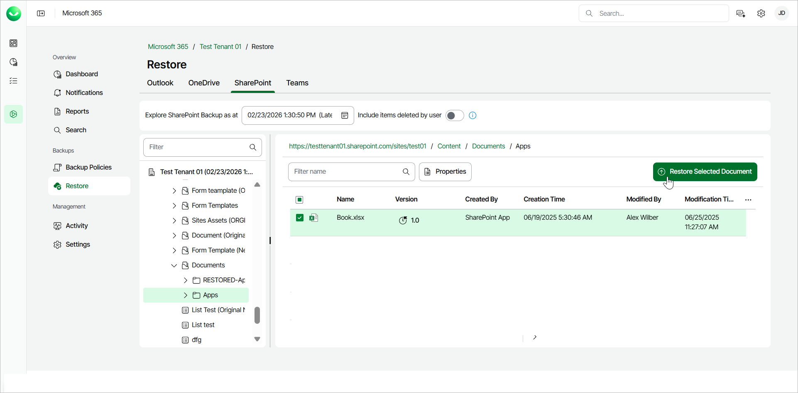
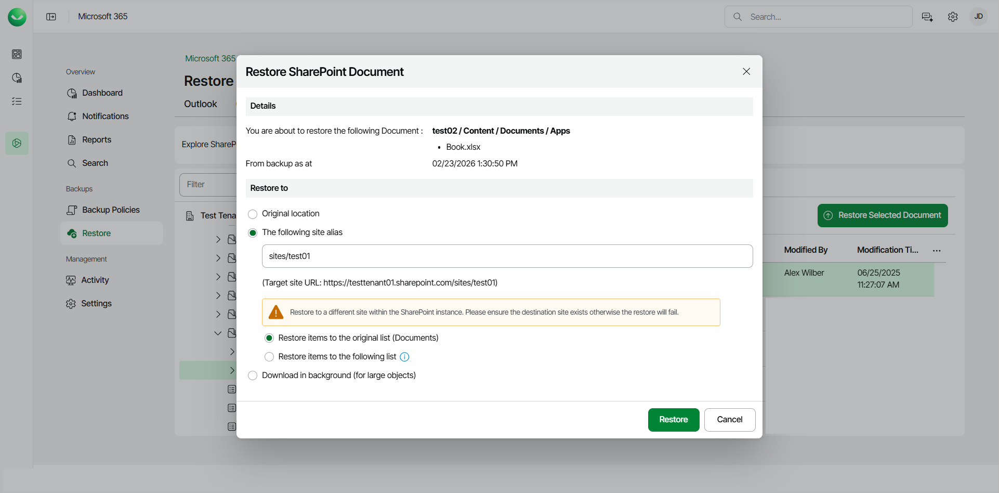

# Restoring SharePoint Documents

Before you start performing restore, check [Considerations and Limitations](m365_considerations_limitations.md#restore).

To restore a SharePoint document from the backup:

1. On the Microsoft 365 page, click the name of the tenant you want to manage.
2. Select Restore.
3. On the SharePoint tab, expand the SharePoint library or folder that contains the document you want to restore.
4. Select the check box next to the necessary document in the list of documents. You can select multiple documents.
5. Click Restore Selected Document.

1. In the Restore SharePoint Document window, check the name of the document you want to restore and the time when the backup that contains the document was created.
2. In the Restore to section, select where to restore the SharePoint document. You can select one of the following options:

* Original location. Select this option if you want to restore the document to its original location.

1. Restore items to the original list. If you select this option, the document will be restored to the original list of the original site.
2. Restore items to the following list. If you select this option, type the name of the list. The document will be restored to the original site, to the list you specified. If the target list does not exist, the restore process will fail.

* The following site alias. Select this option if you want to restore the document to another site within the same SharePoint instance. Type the site alias. Veeam Data Cloud for Microsoft 365 will display the resulting URL of the target site. If the target site does not exist, the restore process will fail.

For multi-geo tenants, the target site must belong to the same protected regions as the current tenant.

1. Restore items to the original list. If you select this option, the document will be restored to the original list of the site you specified.
2. Restore items to the following list. If you select this option, type the name of the list. The document will be restored to the site and list you specified. If the target list does not exist, the restore process will fail.

* Download in background. Select this option if you want to download the document to your computer. Veeam Data Cloud for Microsoft 365 will save the document to a .ZIP file. For more information on how to get the downloaded data, see [Obtaining Downloaded Items](m365_obtain_downloaded_items.md).

1. Start the restore process:

* Click Restore if you selected to restore data to the original location or another site.
* Click Download if you selected to download data in the background.

