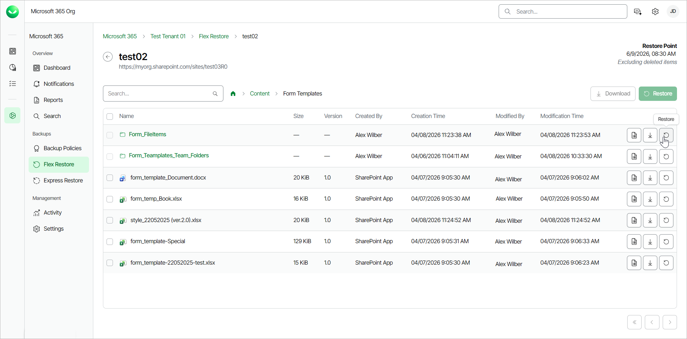
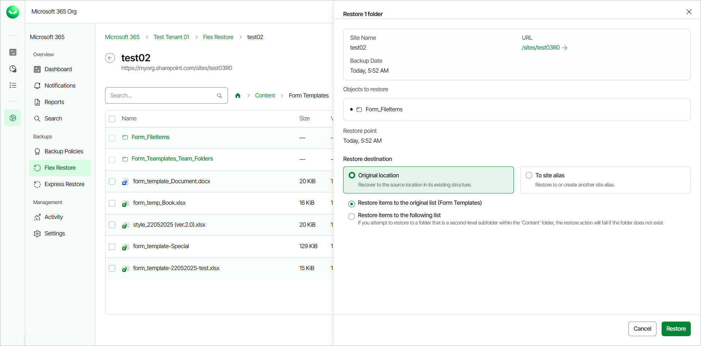
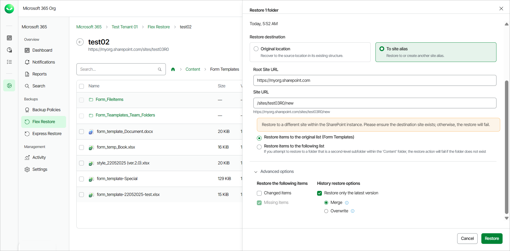

# Restoring SharePoint Folders

Before you start performing restore, check [Considerations and Limitations](m365_considerations_limitations.md#restore).

To restore a SharePoint folder from the backup:

1. On the Microsoft 365 page, click the name of the tenant you want to manage.
2. Select Flex Restore.
3. Go to the SharePoint tab.
4. By default, Veeam Data Cloud uses the latest available restore point for data restore. If you want to select another restore point, click on the  Restore Point information box. On the calendar, select the date and time when the necessary restore point was created and click Apply.
5. Click the name of the SharePoint site that contains the folder you want to restore.
6. Click on the Content folder.
7. In the Actions column of the SharePoint folder you want to restore, click Restore.

1. In the Restore folder window, you can check the name of the folder you want to restore, the site name and URL, the time when the backup that contains the folder was created and the selected restore point.
2. In the Restore destination section, select where to restore the SharePoint folder. You can select one of the following options:

* Original location. Select this option if you want to restore the folder to its original location.

1. Restore items to the original list. If you select this option, the folder will be restored to the list of the original site.
2. Restore items to the following list. If you select this option, in the List name field, type the name of the list. The folder will be restored to the original site, to the list you specified. If the target list does not exist, the restore process will fail.

* To site alias. Select this option if you want to restore the folder to another site within the same SharePoint instance. Type the Root Site URL and the Site URL. Veeam Data Cloud for Microsoft 365 will display the resulting URL of the target site. If the target site does not exist, the restore process will fail.

1. Restore items to the original list. If you select this option, the folder will be restored to the original list of the site you specified.
2. Restore items to the following list. If you select this option, in the List name field, type the name of the list. The folder will be restored to the site and list you specified. If the target list does not exist, the restore process will fail.

For multi-geo tenants, the target site must belong to the same protected regions as the current tenant.

You can click Advanced options to display more options.

1. [Optional] In the Restore reason section, specify a reason for the restore.
2. [For restore to another site] If you want to specify advanced restore options, do the following:

1. Click the Advanced options toggle.
2. In the Restore the following items section, do the following:

1. Select the Changed items check box if you want to restore items that were modified in the production environment.
2. Select the Missing items check box if you want to restore items that are missing in your target location. For example, some of the items were removed and you want to restore them from the backup.

1. In the History restore options section, select the Restore only the latest version check box if you want to restore only the latest version of items. If you select this check box, you can select one of the following options:

* Merge. Select this option to merge the latest version of items in the backup into items in the production environment. Only the latest file versions from the backup are restored and they are added (merged) to the existing file version history (if any).
* Overwrite. Select this option to overwrite items in the production environment with the latest version of items in the backup.

1. Click Restore to start the restore process.

|  |
| --- |
| tip |
| You can download SharePoint folders to your computer. To do that, in the Actions column of the SharePoint folder, click Download. Veeam Data Cloud will save the SharePoint content to a .ZIP file. For more information on how to get the downloaded data, see [Obtaining Downloaded Items](m365_obtain_downloaded_items.md). |

