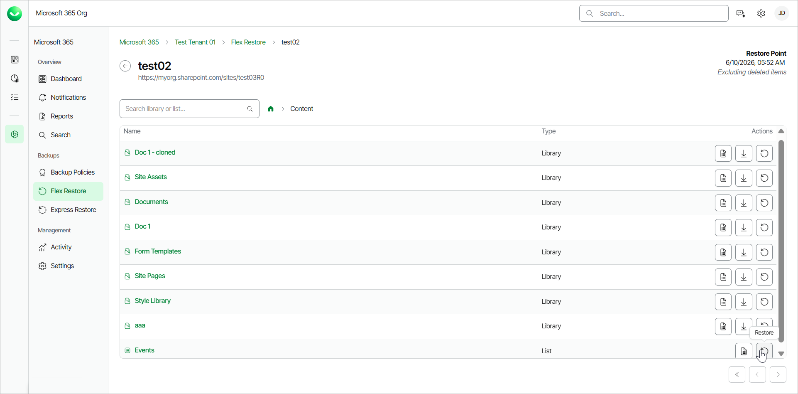
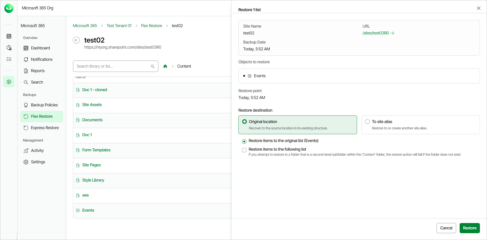
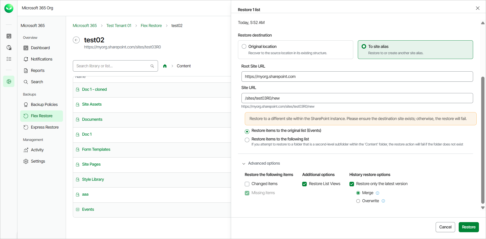

# Restoring SharePoint List Items

Before you start performing restore, check [Considerations and Limitations](m365_considerations_limitations.md#restore).

To restore a SharePoint list or list item from the backup:

1. On the Microsoft 365 page, click the name of the tenant you want to manage.
2. Select Flex Restore.
3. Go to the SharePoint tab.
4. By default, Veeam Data Cloud uses the latest available restore point for data restore. If you want to select another restore point, click on the  Restore Point information box. On the calendar, select the date and time when the necessary restore point was created and click Apply.
5. Click the name of the SharePoint site that contains the list you want to restore.
6. Click on the Content folder.
7. In the Actions column of the SharePoint list you want to restore, click Restore.

To restore a list item, click the name of the list that contains the item. Select the check box next to item you want to restore and click Restore.

1. In the Restore list window, you can check the name of the list or item you want to restore, the site name and URL, the time when the backup that contains the item was created and the selected restore point.
2. In the Restore destination section, select where to restore the SharePoint list or list item. You can select one of the following options:

* Original location. Select this option if you want to restore the item to its original location.

1. Restore items to the original list. If you select this option, the item will be restored to the original list of the original site.
2. Restore items to the following list. If you select this option, in the List name field, type the name of the list. The item will be restored to the original site, to the list you specified. If the target list does not exist, the restore process will fail.

* To site alias. Select this option if you want to restore the list or list item to another site within the same SharePoint instance. Type the Root Site URL and the Site URL. Veeam Data Cloud for Microsoft 365 will display the resulting URL of the target site. If the target site does not exist, the restore process will fail.

For multi-geo tenants, the target site must belong to the same protected regions as the current tenant.

1. Restore items to the original list. If you select this option, the item will be restored to the original list of the site you specified.
2. Restore items to the following list. If you select this option, in the List name field, type the name of the list. The item will be restored to the site and list you specified. If the target list does not exist, the restore process will fail.

1. Click Restore to start the restore process.

|  |
| --- |
| NOTE |
| Options to download SharePoint lists and list items are unavailable. |

