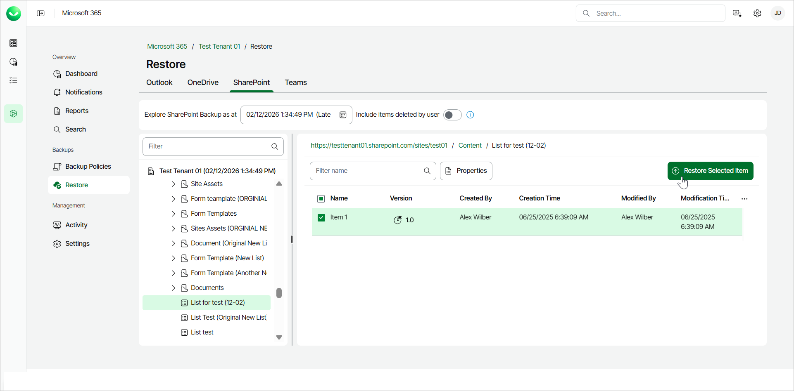
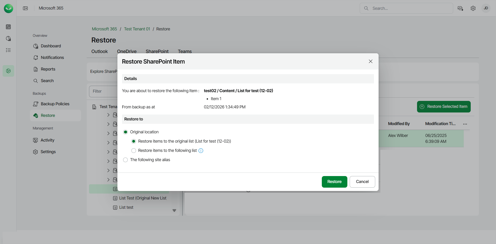
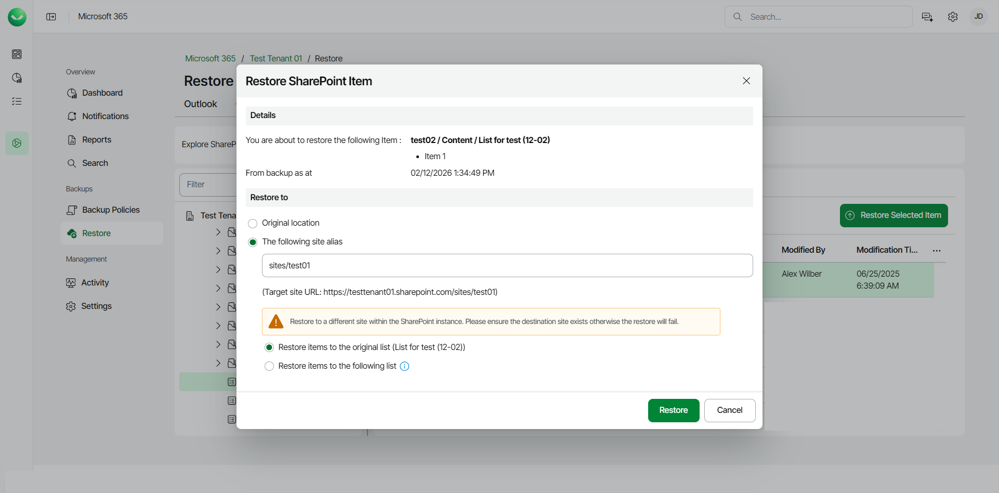

# Restoring SharePoint List Items

Before you start performing restore, check [Considerations and Limitations](m365_considerations_limitations.md#restore).

To restore a SharePoint list item from the backup:

1. On the Microsoft 365 page, click Manage next to the tenant you want to work with.
2. Select Restore.
3. On the SharePoint tab, browse to the list that contains the item you want to restore.
4. Select the check box next to the necessary item in the list of items. You can select multiple items.
5. Click Restore Selected Item.

1. In the Restore SharePoint Item window, check the name of the item you want to restore and the time when the backup that contains the item was created.
2. In the Restore to section, select where to restore the SharePoint item. You can select one of the following options:

* Original location. Select this option if you want to restore the item to its original location.

1. Restore items to the original list. If you select this option, the item will be restored to the original list of the original site.
2. Restore items to the following list. If you select this option, type the name of the list. The item will be restored to the original site, to the list you specified. If the target list does not exist, the restore process will fail.

* The following site alias. Select this option if you want to restore the item to another site within the same SharePoint instance. Type the Root Site URL and the Site URL. Veeam Data Cloud for Microsoft 365 will display the resulting URL of the target site. If the target site does not exist, the restore process will fail.

For multi-geo tenants, the target site must belong to the same protected regions as the current tenant.

1. Restore items to the original list. If you select this option, the item will be restored to the original list of the site you specified.
2. Restore items to the following list. If you select this option, type the name of the list. The item will be restored to the site and list you specified. If the target list does not exist, the restore process will fail.

|  |
| --- |
| NOTE |
| Options to download SharePoint list items are unavailable. |

1. Click Restore to start the restore process.

