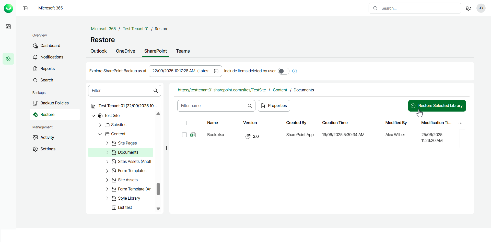
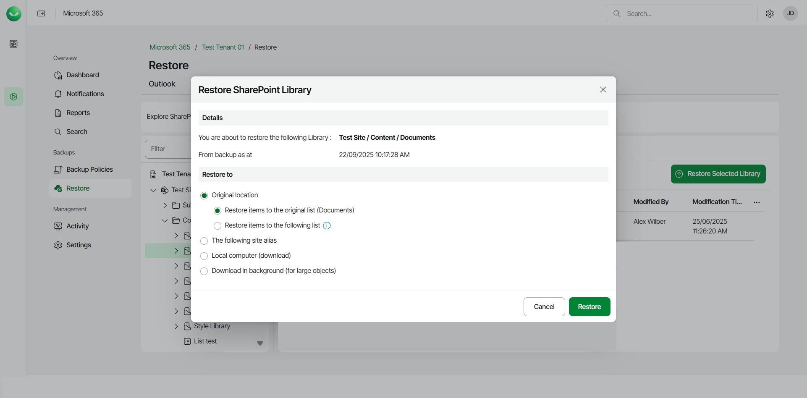
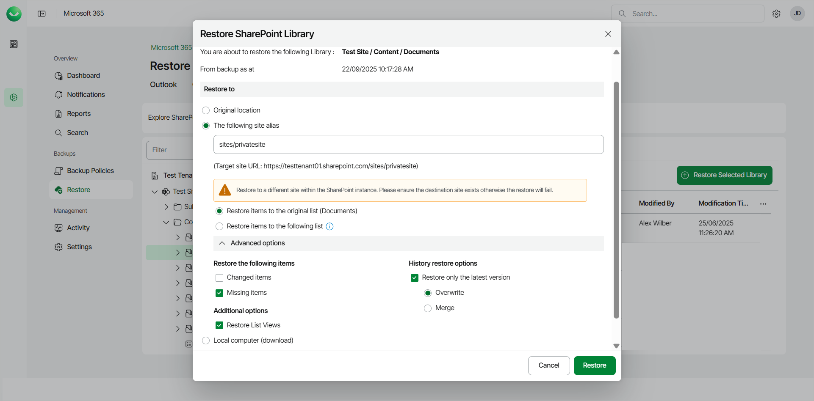

# Restoring SharePoint Libraries

Before you start performing restore, check [Considerations and Limitations](m365_considerations_limitations.md#restore).

To restore a SharePoint library from the backup:

1. On the Microsoft 365 page, click the name of the tenant you want to manage.
2. Select Restore.
3. On the SharePoint tab, expand the SharePoint site that contains the library you want to restore.
4. Select the SharePoint library you want to restore.
5. Click Restore Selected Library.

1. In the Restore SharePoint Library window, check the name of the library you want to restore and the time when the backup that contains the library was created.
2. In the Restore to section, select where to restore the SharePoint library. You can select one of the following options:

* Original location. Select this option if you want to restore the library to its original location.

1. Restore items to the original list. If you select this option, the library will be restored to the Documents list of the original site.
2. Restore items to the following list. If you select this option, type the name of the list. The library will be restored to the original site, to the list you specified. If the target list does not exist, the restore process will fail.

* The following site alias. Select this option if you want to restore the library to another site within the same SharePoint instance. Type the site alias. Veeam Data Cloud for Microsoft 365 will display the resulting URL of the target site. If the target site does not exist, the restore process will fail.

1. Restore items to the original list. If you select this option, the library will be restored to the Documents list of the site you specified.
2. Restore items to the following list. If you select this option, type the name of the list. The library will be restored to the site and list you specified. If the target list does not exist, the restore process will fail.

You can click Advanced options to display more options. For details, see the next step of the procedure.

* Download in background. Select this option if you want to download the library content to your computer. Veeam Data Cloud for Microsoft 365 will save the library content to a .ZIP file. For more information on how to get the downloaded data, see [Obtaining Downloaded Items](m365_obtain_downloaded_items.md).

1. [For restore to another site] If you want to specify advanced restore options, do the following:

1. Click Advanced options.
2. In the Restore the following items section, do the following:

1. Select the Changed items check box if you want to restore items that have been modified in the production environment.
2. Select the Missing items check box if you want to restore items that are missing in your target location. For example, some of the items were removed and you want to restore them from the backup.

1. In the History restore options section, select the Restore only the latest version check box if you want to restore only the latest version of items. If you select this check box, you can select one of the following options:

* Overwrite. Select this option to overwrite items in the production environment with the latest version of items in the backup.
* Merge. Select this option to merge the latest version of items in the backup into items in the production environment.

1. In the Additional options section, select the Restore List Views check box if you want to restore list views of the restored library.

1. Start the restore process:

* Click Restore if you selected to restore data to the original location or another site.
* Click Download if you selected to download data in the background.

