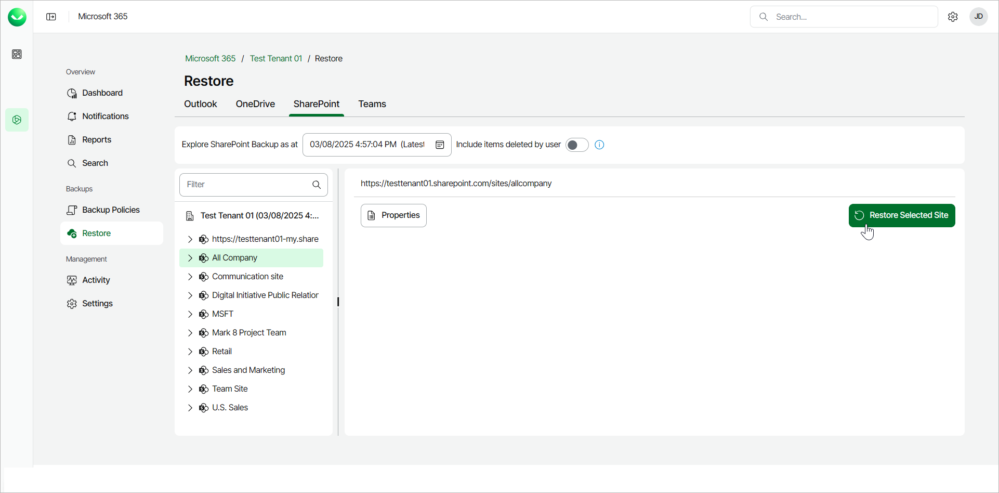
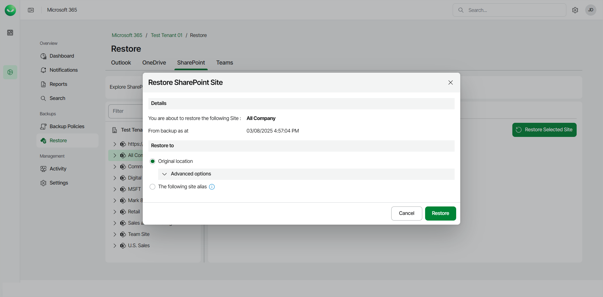
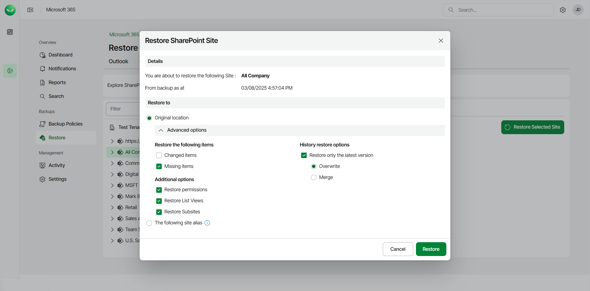
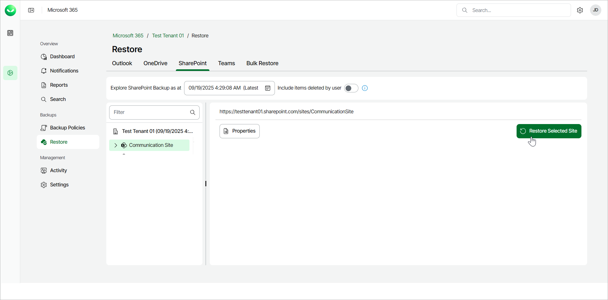
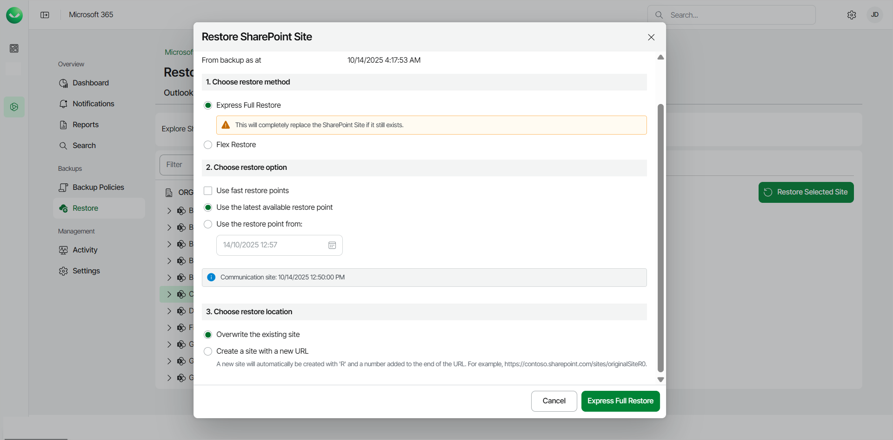

# Restoring SharePoint Sites

Veeam Data Cloud for Microsoft 365 offers 2 restore methods for restore of SharePoint sites: Flex Restore and Express Full Restore.

The restore method options available to you depend on what backup policy type covers the Microsoft 365 user whose data you restore. The backup policy type defines the plan of the backed-up user. To learn more about plans in Veeam Data Cloud for Microsoft 365, see [Plans](m365_licensing.md#plans).

Before you start performing restore, check [Considerations and Limitations](m365_considerations_limitations.md#restore).

Flex Restore

To restore an entire SharePoint site from the backup:

1. On the Microsoft 365 page, click the name of the tenant you want to manage.
2. Select Restore and go to the SharePoint tab.
3. By default, Veeam Data Cloud for Microsoft 365 uses the latest available restore point for data restore. If you want to select another restore point, in the Explore SharePoint Backup as at field, click the calendar icon and select the date and time when the necessary restore point was created.
4. Select the site that you want to restore.
5. Click Restore Selected Site.

1. In the Restore to section, select where to restore the site. You can select one of the following options:

* Original location. Select this option if you want to restore the site to its original location.
* The following site alias. Select this option if you want to restore the site content to another site within the same SharePoint instance.

If you select this option, type the site alias. Veeam Data Cloud for Microsoft 365 will display the resulting URL of the target site.

|  |
| --- |
| NOTE |
| Options to download SharePoint sites are unavailable. |

1. If you want to specify advanced restore options, do the following:

1. Click Advanced options.
2. In the Restore the following items section, do the following:

1. Select the Changed items check box if you want to restore items that have been modified in the production environment.
2. Select the Missing items check box if you want to restore items that are missing in your target location. For example, some of the items were removed and you want to restore them from the backup.

1. In the History restore options section, select the Restore only the latest version check box if you want to restore only the latest version of items. If you select this check box, you can select one of the following options:

* Overwrite. Select this option to overwrite items in the production environment with the latest version of items in the backup.
* Merge. Select this option to merge the latest version of items in the backup into items in the production environment.

1. In the Additional options section, do the following:

1. [For restore to original location] Select the Restore permissions check box if you want to restore permissions of the document libraries and lists within the restored site. If you do not select this option, permissions for document libraries and lists that exist in the target location will be preserved. Permissions for document libraries and lists that do not exist in the target location will be inherited from their parent objects.
2. Select the Restore List Views check box if you want to restore list views of the restored site.
3. Select the Restore Subsites check box if you want to restore subsites of the restored site.

1. Click Restore to start the restore process.

Express Full Restore

Before you start performing restore, check [Considerations and Limitations](m365_considerations_limitations.md#exrestore).

To restore an entire SharePoint site from the backup:

1. On the Microsoft 365 page, click the name of the tenant you want to manage.
2. Select Restore.
3. On the SharePoint tab, select the site that you want to restore.

To restore multiple SharePoint sites, click on your organization and then select the check boxes next to the SharePoint sites you want to restore. You can restore multiple SharePoint sites only to the original location.

1. Click Restore Selected Site.

1. In the Restore SharePoint Site window, in the Choose restore method section, select Express Full Restore.
2. In the Choose restore option section, select the restore point from which you want to restore the site. You can select one of the following options:

* Use the latest available restore point. If you select this option, Veeam Data Cloud for Microsoft 365 will restore data from the latest restore point of the backup.

* Use the restore point from. If you select this option, you can select the date and time when the necessary restore point was created. Veeam Data Cloud for Microsoft 365 will restore data from this restore point.

Select the Use fast restore points check box if you want to select from the fastest available restore points created by Express backup policies.

1. In the Choose restore location option, select where you want to restore the data. You can select one of the following options:

* Overwrite the existing site. Select this option to replace data in the original location with the data from the backup.
* Create a site with a new URL. Select this option to restore the data to a new location. Veeam Data Cloud restores the data to a newly created site with an R and a number added to the end of the URL. For example, https://contoso.sharepoint.com/sites/originalSiteR0.

1. Click Express Full Restore to start the restore process.

