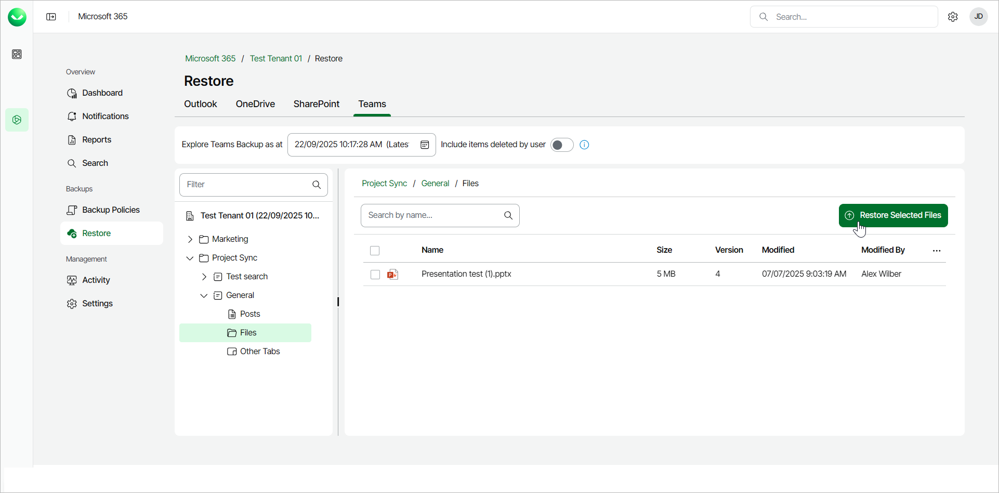
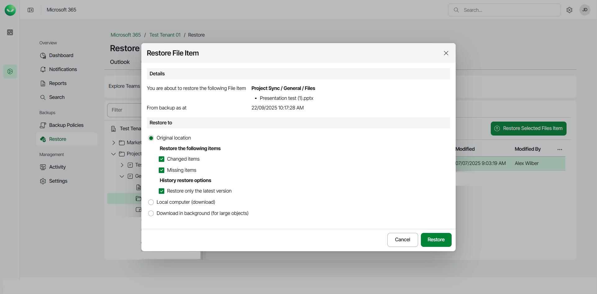

# Restoring Files

You can use Veeam Data Cloud for Microsoft 365 to restore files of Microsoft Teams channels. You can restore either all files of a channel or specific files.

Restoring All Files

To restore all files of a Microsoft Teams channel:

1. On the Microsoft 365 page, click the name of the tenant you want to manage.

|  |
| --- |
| Note |
| Consider the following:   * If the organization does not have any backups, the Teams Restore tab will be empty.  * Backup and restore of Microsoft Teams data is available to users of the Foundation and Premium plans only. Users can restore Teams data flexibly and do not need to select the restore method. * Before you start performing restore, check [Considerations and Limitations](m365_considerations_limitations.md#restore). |

1. Select Restore.
2. On the Teams tab, expand the team whose channel files you want to restore.
3. Expand the channel whose files you want to restore and select Files.
4. Click Restore Selected Files.

1. In the Restore Files window, check the name of the team and channel whose files you want to restore, and the time when the backup was created.
2. In the Restore to section, select where to restore files. You can select one of the following options:

* Original location. Select this option if you want to restore files to the original channel.
* Download in background. Select this option if you want to download the files to your computer. For more information on how to get the downloaded data, see [Obtaining Downloaded Items](m365_obtain_downloaded_items.md).

1. [For restore to the original location] If you want to specify advanced restore options, do the following:

1. In the Restore the following items section, do the following:

1. Select the Changed items check box if you want to restore items that have changed since the time when the backup was created. When you select this option, Veeam Data Cloud for Microsoft 365 overwrites existing items in the original team.
2. Select the Missing items check box if you want to restore items that are missing in the original team. For example, some of the items were removed and you want to restore them from the backup.

1. In the History restore options section, select the Restore only the latest version check box if you want to restore only the latest version of items.

1. Start the restore process:

* Click Restore if you selected to restore data to the original location.
* Click Download if you selected to download data in the background.

Restoring Specific Files

To restore specific files of a Microsoft Teams channel:

1. On the Microsoft 365 page, click the name of the tenant you want to manage.
2. Select Restore.
3. On the Teams tab, expand the team whose channel files you want to restore.
4. Expand the channel whose files you want to restore and select Files.
5. Select the check box next to the necessary file in the list of items and click Restore Selected Files Item. You can select multiple files.

1. In the Restore File Item window, check the name of the team, channel and file you want to restore, and the time when the backup was created.
2. In the Restore to section, select where to restore files. You can select one of the following options:

* Original Location. Select this option if you want to restore files to the original channel.
* Download in background. Select this option if you want to download the files to your computer.

1. [For restore to the original location] If you want to specify advanced restore options, do the following:

1. In the Restore the following items section, do the following:

1. Select the Changed items check box if you want to restore items that have changed since the time when the backup was created. When you select this option, Veeam Data Cloud for Microsoft 365 overwrites existing items in the original team.
2. Select the Missing items check box if you want to restore items that are missing in the original team. For example, some of the items were removed and you want to restore them from the backup.

1. In the History restore options section, select the Restore only the latest version check box if you want to restore only the latest version of items.

1. Start the restore process:

* Click Restore if you selected to restore data to the original location.
* Click Download if you selected to download data in the background.

