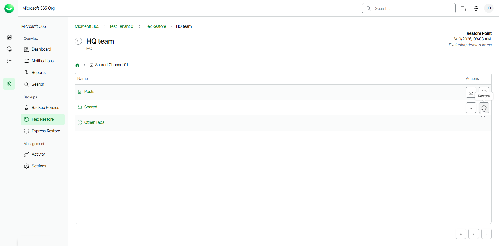
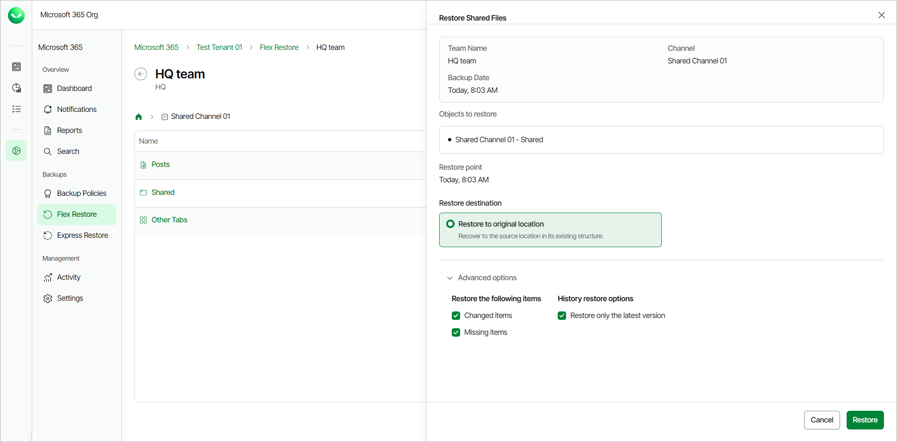
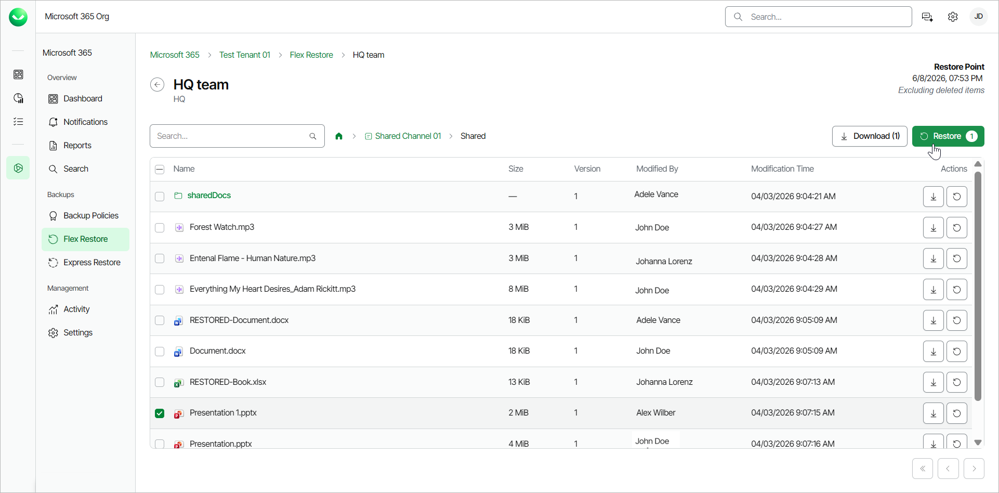
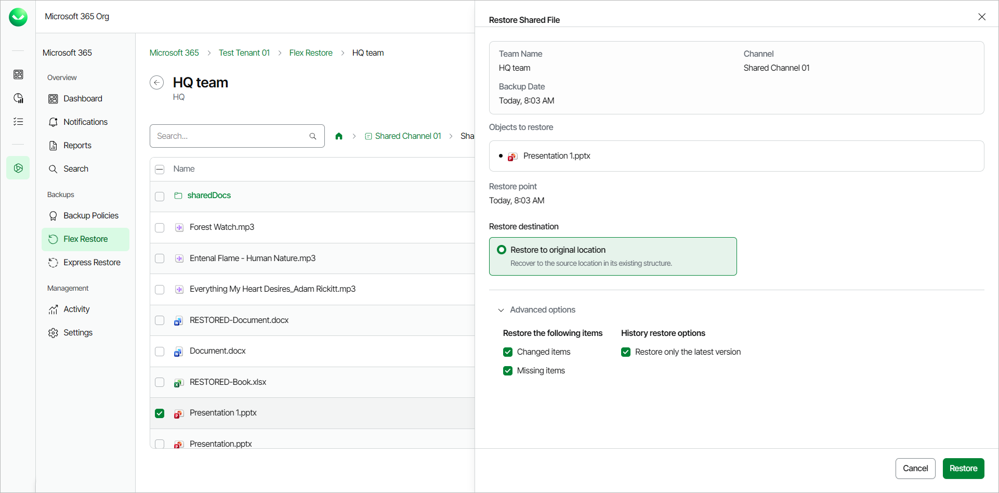

# Restoring Shared Files

You can use Veeam Data Cloud for Microsoft 365 to restore shared files of Microsoft Teams channels. You can restore either all shared files of a channel or specific shared files.

Restoring All Shared Files

To restore all shared files of a Microsoft Teams channel:

1. On the Microsoft 365 page, click the name of the tenant you want to manage.

|  |
| --- |
| Note |
| Consider the following:   * If the organization does not have any backups, the Teams Restore tab will be empty.  * Backup and restore of Microsoft Teams data is available to users with Flex-based backup policies only. Users can restore Teams data flexibly and do not need to select the restore method. * Before you start performing restore, check [Considerations and Limitations](m365_considerations_limitations.md#restore). |

1. Select Flex Restore.
2. Go to the Teams tab.
3. By default, Veeam Data Cloud uses the latest available restore point for data restore. If you want to select another restore point, click on the  Restore Point information box. On the calendar, select the date and time when the necessary restore point was created and click Apply.
4. Click the name of the team whose shared files you want to restore.
5. Click the name of the channel whose shared files you want to restore.
6. In the Actions column of the Shared files folder, click Restore.

1. In the Restore Shared Files window, you can check the name of the team and channel whose shared files you want to restore, the time when the backup was created and the selected restore point.
2. In the Restore destination section, check that the Restore to original location option is selected. You can restore shared files to the original location only.

1. If you want to specify advanced restore options, do the following:

1. Click the Advanced options toggle.
2. In the Restore the following items section, do the following:

1. Select the Changed items check box if you want to restore items that were changed since the time when the backup was created. When you select this option, Veeam Data Cloud for Microsoft 365 overwrites existing items in the original team.
2. Select the Missing items check box if you want to restore items that are missing in the original team. For example, some of the items were removed and you want to restore them from the backup.

1. In the History restore options section, select the Restore only the latest version check box if you want to restore only the latest version of items.

1. Click Restore to start the restore process.

|  |
| --- |
| tip |
| You can download all Teams Shared files to your computer. To do that, in the Actions column of the Shared files folder, click Download as .zip. Veeam Data Cloud will save the Shared files to a .ZIP file. For more information on how to get the downloaded data, see [Obtaining Downloaded Items](m365_obtain_downloaded_items.md). |

Restoring Specific Shared Files

To restore specific shared files of a Microsoft Teams channel:

1. On the Microsoft 365 page, click the name of the tenant you want to manage.
2. Select Flex Restore.
3. Go to the Teams tab.
4. By default, Veeam Data Cloud uses the latest available restore point for data restore. If you want to select another restore point, click on the  Restore Point information box. On the calendar, select the date and time when the necessary restore point was created and click Apply.
5. Click the name of the team whose shared files you want to restore.
6. Click the name of the channel whose shared files you want to restore.
7. Click on the Shared folder.
8. Select the check box next to the necessary file in the list of files and click Restore. You can select multiple files.

1. In the Restore Shared File window, you can check the name of the team, channel and shared file you want to restore, the time when the backup was created and the selected restore point.
2. In the Restore destination section, check that the Restore to original location option is selected. You can restore shared files to the original location only.

1. If you want to specify advanced restore options, do the following:

1. Click the Advanced options toggle.
2. In the Restore the following items section, do the following:

1. Select the Changed items check box if you want to restore items that were changed since the time when the backup was created. When you select this option, Veeam Data Cloud for Microsoft 365 overwrites existing items in the original team.
2. Select the Missing items check box if you want to restore items that are missing in the original team. For example, some of the items were removed and you want to restore them from the backup.

1. In the History restore options section, select the Restore only the latest version check box if you want to restore only the latest version of items.

1. Click Restore to start the restore process.

|  |
| --- |
| tip |
| You can download specific Teams Shared files to your computer. To do that, select the check box next to the shared file and click Download. Veeam Data Cloud will save the Teams shared file to a .ZIP file. For more information on how to get the downloaded data, see [Obtaining Downloaded Items](m365_obtain_downloaded_items.md). |

