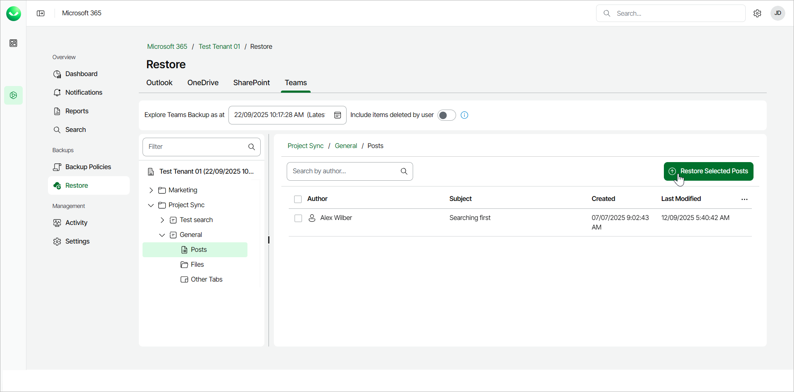
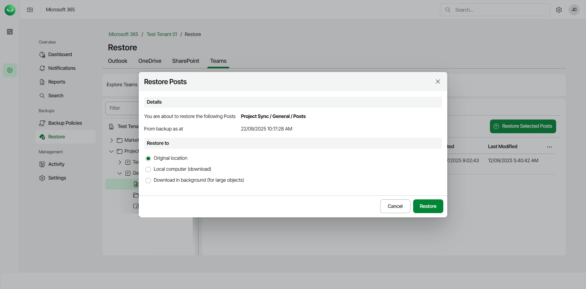
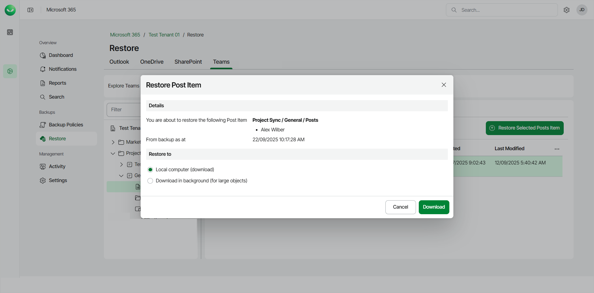

# Restoring Posts

In this article

You can use Veeam Data Cloud for Microsoft 365 to restore posts of Microsoft Teams channels. The restore options differ depending on whether you want to restore all posts of a channel or specific posts.

* All posts of a channel can be either restored to the original channel or downloaded to a local computer.
* Specific posts can be downloaded to a local computer only.

Restoring All Posts

To restore all posts of a Microsoft Teams channel:

1. On the Microsoft 365 page, click the name of the tenant you want to manage.

|  |
| --- |
| Note |
| Consider the following:   * If the organization does not have any backups, the Teams Restore tab will be empty.  * Backup and restore of Microsoft Teams data is available to users of the Flex and Premium plans only. Users can restore Teams data flexibly and do not need to select the restore method.  * To be able to restore team posts, make sure that Microsoft team chats backup is enabled. For details, see [Enabling Microsoft Team Chats Backup](m365_enable_team_chats_backup.md).   If team chats backup is not enabled for the organization, the backup does not contain team posts, and no posts are available for restore when you select the Posts node on the Teams Restore tab.   * Before you start performing restore, check [Considerations and Limitations](m365_considerations_limitations.md#restore). |

1. Select Restore.
2. On the Teams tab, expand the team whose channel posts you want to restore.
3. Expand the channel whose posts you want to restore and select Posts.
4. Click Restore Selected Posts.

1. In the Restore Posts window, check the name of the team and channel whose posts you want to restore, and the time when the backup was created.
2. In the Restore to section, select where to restore posts. You can select one of the following options:

* Original location. Select this option if you want to restore posts to the original channel. Veeam Data Cloud for Microsoft 365 will create a new tab in the original channel and restore posts to this tab.
* Local computer. Select this option if you want to download posts to your computer. Use this option for posts whose total size does not exceed 1 GB. Veeam Data Cloud for Microsoft 365 will save the posts to a .ZIP file.
* Download in background. Select this option if you want to download the item to your computer. Use this option for items whose total size exceeds 1 GB or if the download process takes more than 3.5 minutes. Veeam Data Cloud for Microsoft 365 will save the posts to a .ZIP file. For more information on how to get the downloaded data, see [Obtaining Downloaded Items](m365_obtain_downloaded_items.md).

1. Start the restore process:

* Click Restore if you selected to restore posts to the original location.
* Click Download if you selected to download posts to the local computer or download posts in the background.

Restoring Specific Posts

To restore specific posts of a Microsoft Teams channel:

1. On the Microsoft 365 page, click the name of the tenant you want to manage.
2. Select Restore.
3. On the Teams tab, expand the team whose channel posts you want to restore.
4. Expand the channel whose posts you want to restore and select Posts.
5. Select the check box next to the necessary post in the list of items and click Restore Selected Posts Item. You can select multiple posts.

1. In the Restore Post Item window, check the name of the team, channel and post you want to restore, and the time when the backup was created.
2. In the Restore to section, select where to restore posts. You can select one of the following options:

* Local computer. Select this option if you want to download posts to your computer. Use this option for posts whose total size does not exceed 1 GB. Veeam Data Cloud for Microsoft 365 will save the posts to a .ZIP file.
* Download in background. Select this option if you want to download the item to your computer. Use this option for items whose total size exceeds 1 GB or if the download process takes more than 3.5 minutes. Veeam Data Cloud for Microsoft 365 will save the posts to a .ZIP file.

1. Click Download to start the download process.

Page updated 9/22/2025
