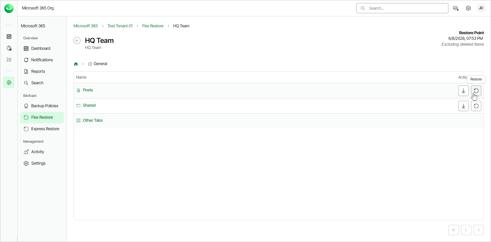
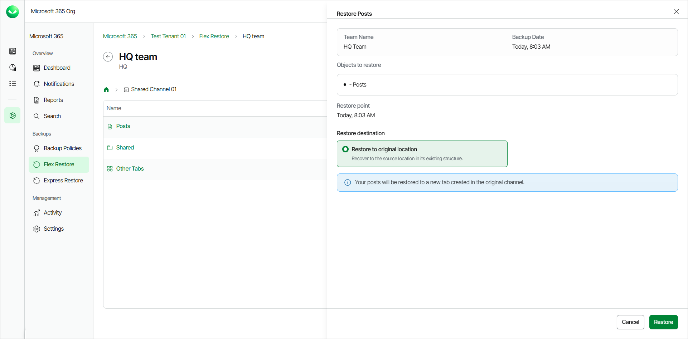
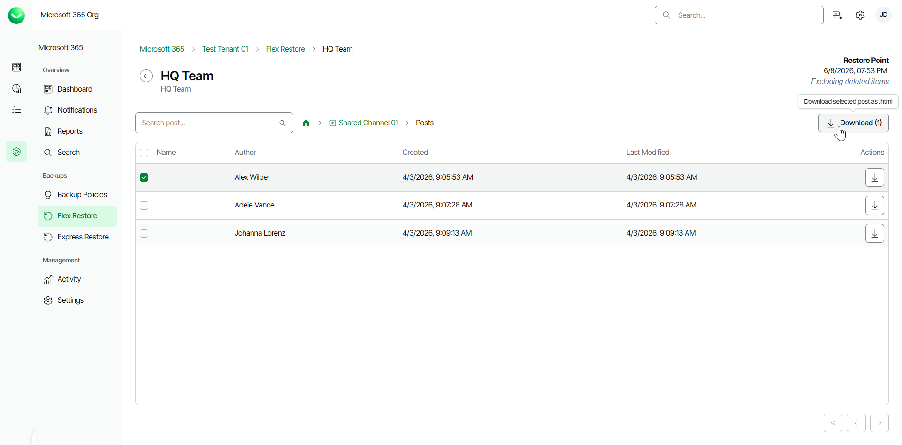

# Restoring Posts

You can use Veeam Data Cloud for Microsoft 365 to restore posts of Microsoft Teams channels. The restore options differ depending on whether you want to restore all posts of a channel or specific posts.

* All posts of a channel can be either restored to the original channel or downloaded to a local computer.
* Specific posts can be downloaded to a local computer only.

Restoring All Posts

To restore all posts of a Microsoft Teams channel:

1. On the Microsoft 365 page, click the name of the tenant you want to manage.

|  |
| --- |
| Note |
| Consider the following:   * If the organization does not have any backups, the Teams Restore tab will be empty.  * Backup and restore of Microsoft Teams data is available to users with Flex-based backup policies only. Users can restore Teams data flexibly and do not need to select the restore method.  * To be able to restore team posts, make sure that Microsoft team posts backup is enabled. For details, see [Enabling Microsoft Team Posts Backup](m365_enable_team_chats_backup.md).   If team posts backup is not enabled for the organization, the backup does not contain team posts, and no posts are available for restore when you select the Posts node on the Teams Restore tab.   * Before you start performing restore, check [Considerations and Limitations](m365_considerations_limitations.md#restore). |

1. Select Flex Restore.
2. Go to the Teams tab.
3. By default, Veeam Data Cloud uses the latest available restore point for data restore. If you want to select another restore point, click on the  Restore Point information box. On the calendar, select the date and time when the necessary restore point was created and click Apply.
4. Click the name of the team whose posts you want to restore.
5. Click the name of the channel whose posts you want to restore.
6. In the Actions column of the Posts folder, click Restore.

1. In the Restore Posts window, you can check the name of the team whose posts you want to restore, the time when the backup was created and the selected restore point.
2. In the Restore destination section, check that the Restore to original location option is selected. You can restore posts to the original location only.

1. [Optional] In the Restore reason section, specify a reason for the restore.
2. Click Restore to start the restore process. Your posts will be restored to a new tab created in the original channel.

|  |
| --- |
| tip |
| You can download all Teams posts to your computer. To do that, in the Actions column of the Posts, click Download as .zip. Veeam Data Cloud will save the Teams posts to a .ZIP file. For more information on how to get the downloaded data, see [Obtaining Downloaded Items](m365_obtain_downloaded_items.md). |

Restoring Specific Posts

To restore specific posts of a Microsoft Teams channel:

1. On the Microsoft 365 page, click the name of the tenant you want to manage.
2. Select Flex Restore.
3. Go to the Teams tab.
4. By default, Veeam Data Cloud uses the latest available restore point for data restore. If you want to select another restore point, click on the  Restore Point information box. On the calendar, select the date and time when the necessary restore point was created and click Apply.
5. Click the name of the team whose posts you want to restore.
6. Click the name of the channel whose posts you want to restore.
7. Click on the Posts folder.
8. Select the check box next to the necessary post in the list of items and click Download. You can select multiple posts.

Veeam Data Cloud downloads the posts in the .HTML format.

