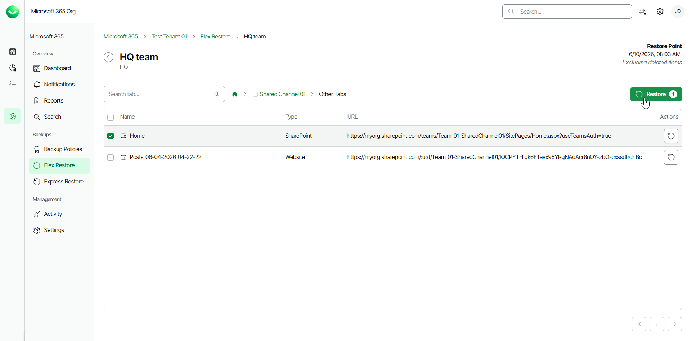
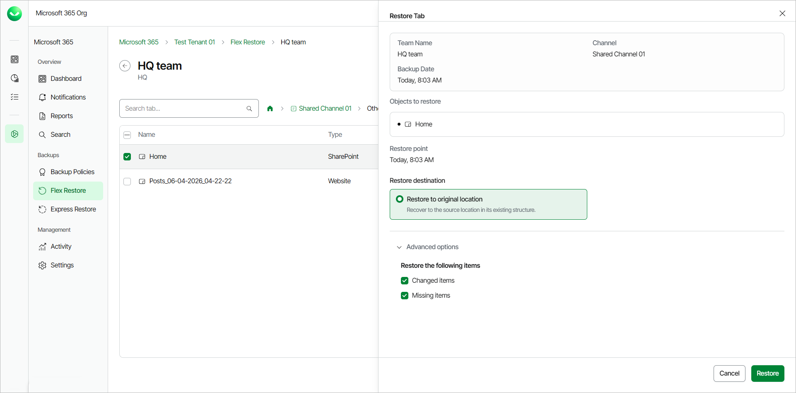

# Restoring Tabs

To restore a Microsoft Teams channel tab:

1. On the Microsoft 365 page, click the name of the tenant you want to work with.

|  |
| --- |
| Note |
| Consider the following:   * If the organization does not have any backups, the Teams Restore tab will be empty.  * Backup and restore of Microsoft Teams data is available to users with Flex-based backup policies only. Users can restore Teams data flexibly and do not need to select the restore method. * Before you start performing restore, check [Considerations and Limitations](m365_considerations_limitations.md#restore). |

1. Select Flex Restore.
2. Go to the Teams tab.
3. By default, Veeam Data Cloud uses the latest available restore point for data restore. If you want to select another restore point, click on the  Restore Point information box. On the calendar, select the date and time when the necessary restore point was created and click Apply.
4. Click the name of the team whose tabs you want to restore.
5. Click the name of the channel whose tabs you want to restore.
6. Click on the Other Tabs folder.
7. Select the check box next to the necessary tab in the list of tabs and click Restore. You can select multiple tabs.

1. In the Restore Tab window, you can check the name of the team, channel and tab you want to restore, the time when the backup was created and the selected restore point.
2. In the Restore destination section, check that the Restore to original location option is selected. You can restore channel tabs to their original location only. Other restore options are unavailable.
3. [Optional] In the Restore reason section, specify a reason for the restore.
4. If you want to specify advanced restore options, do the following:

1. Click the Advanced options toggle.
2. In the Restore the following items section, you can do the following:

* Select the Changed items check box if you want to restore items that were changed since the time when the backup was created. When you select this option, Veeam Data Cloud for Microsoft 365 overwrites existing items in the original team.
* Select the Missing items check box if you want to restore items that are missing in the original team. For example, some of the items were removed and you want to restore them from the backup.

1. Click Restore to start the restore process.

