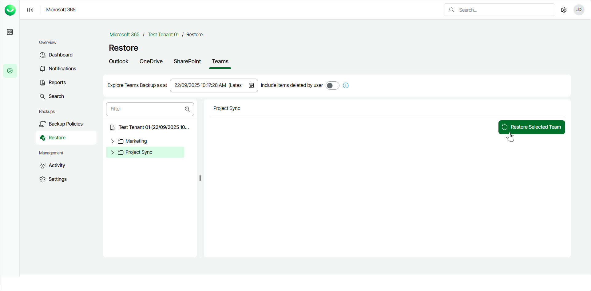
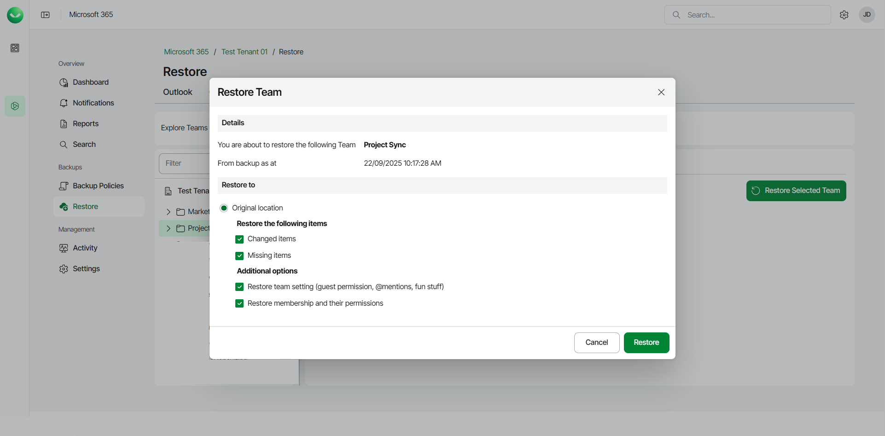

# Restoring Teams

To restore a Microsoft Teams team:

1. On the Microsoft 365 page, click the name of the tenant you want to manage.

|  |
| --- |
| Note |
| Consider the following:   * If the organization does not have any backups, the Teams Restore tab will be empty. * Backup and restore of Microsoft Teams data is available to users of the Flex and Premium plans only. Users can restore Teams data flexibly and do not need to select the restore method. * Before you start performing restore, check [Considerations and Limitations](m365_considerations_limitations.md#restore). |

1. Select Restore.
2. On the Teams tab, select the team you want to restore.

To restore multiple teams, click on your organization and then select the check boxes next to the teams you want to restore.

1. Click Restore Selected Team.

1. In the Restore Team window, check the name of the team you want to restore and the time when the backup was created.
2. In the Restore to section, check that the Original location option is selected. You can restore teams to the original location only. Other restore options are unavailable.
3. If you want to specify advanced restore options, do the following:

1. In the Restore the following items section, do the following:

1. Select the Changed items check box if you want to restore items that have changed since the time when the backup was created. When you select this option, Veeam Data Cloud for Microsoft 365 overwrites existing items in the original team.
2. Select the Missing items check box if you want to restore items that are missing in the original team. For example, some items were removed, and you want to restore them from the backup.

1. In the Additional options section, do the following:

1. Select the Restore team setting check box if you want to replace the current team settings with team settings from the backup.
2. Select the Restore membership and their permissions check box if you want to restore information about team members and their roles from the backup.

1. Click Restore to restore the team according to the specified restore options.

