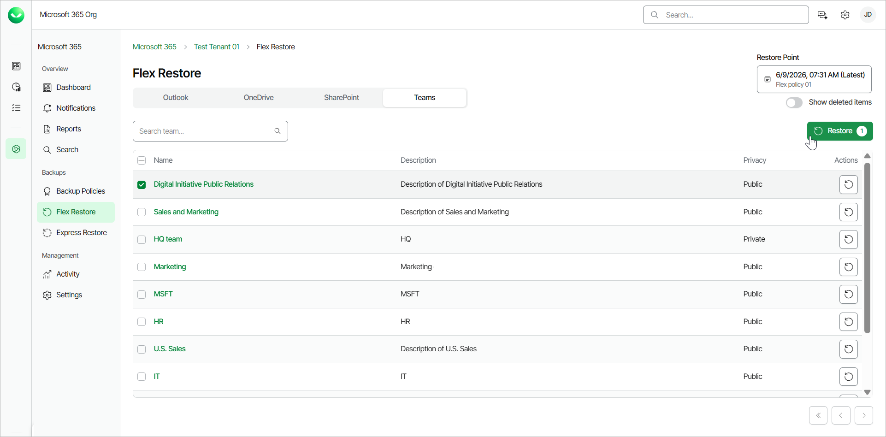
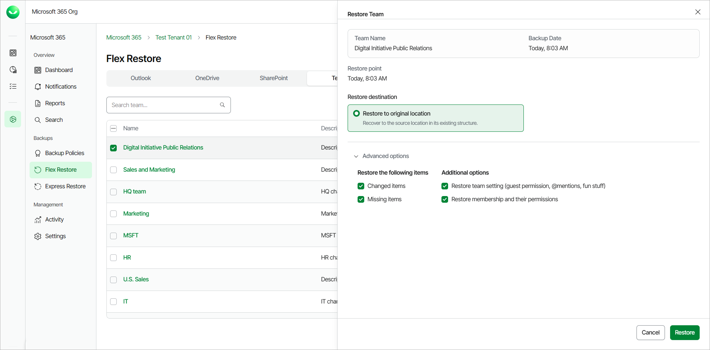

# Restoring Teams

To restore a Microsoft Teams team:

1. On the Microsoft 365 page, click the name of the tenant you want to manage.

|  |
| --- |
| Note |
| Consider the following:   * If the organization does not have any backups, the Teams Restore tab will be empty. * Backup and restore of Microsoft Teams data is available to users with Flex-based backup policies only. Users can restore Teams data flexibly and do not need to select the restore method. * Before you start performing restore, check [Considerations and Limitations](m365_considerations_limitations.md#restore). |

1. Select Flex Restore.
2. Go to the Teams tab.
3. By default, Veeam Data Cloud uses the latest available restore point for data restore. If you want to select another restore point, click on the Restore Point information box. On the calendar, select the date and time when the necessary restore point was created and click Apply.
4. If you want to view all the available restore points for a team, in the Actions column of the team, click View all restore points of this object. In the Restore Points window, you can view all the restore points for the team, from newest to oldest.
5. Select the check box next to the team you want to restore.

To restore multiple teams, select the check boxes next to the teams you want to restore.

1. Click Restore.

1. In the Restore Team window, you can check the name of the team you want to restore, the time when the backup was created and the selected restore point.
2. In the Restore destination section, check that the Restore to original location option is selected. You can restore teams to the original location only. Other restore options are unavailable.
3. [Optional] In the Restore reason section, specify a reason for the restore.
4. If you want to specify advanced restore options, do the following:

1. Click the Advanced options toggle.
2. In the Restore the following items section, do the following:

1. Select the Changed items check box if you want to restore items that were changed since the time when the backup was created. When you select this option, Veeam Data Cloud for Microsoft 365 overwrites existing items in the original team.
2. Select the Missing items check box if you want to restore items that are missing in the original team. For example, some items were removed, and you want to restore them from the backup.

1. In the Additional options section, do the following:

1. Select the Restore team setting check box if you want to replace the current team settings with team settings from the backup.
2. Select the Restore membership and their permissions check box if you want to restore information about team members and their roles from the backup.

1. Click Restore to start the restore process.

