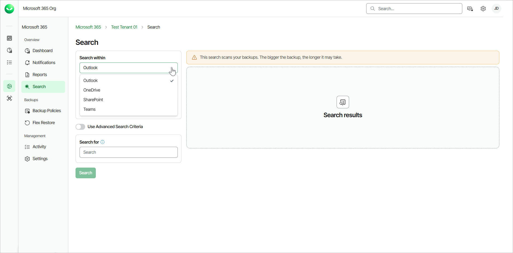
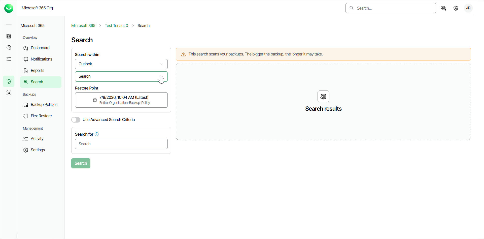
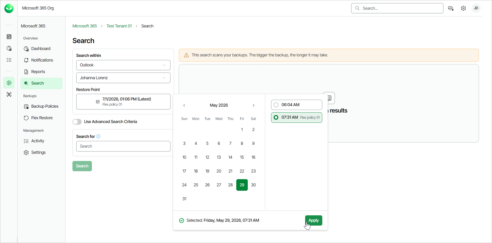
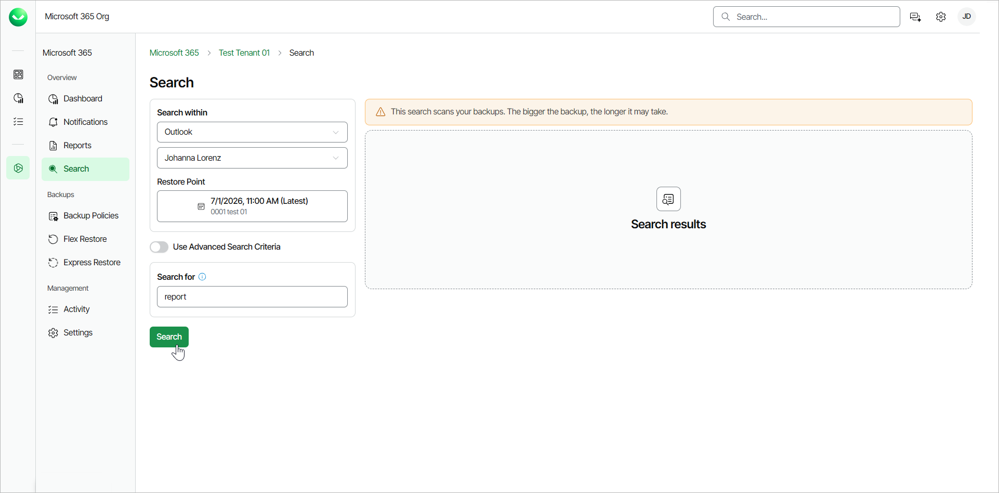
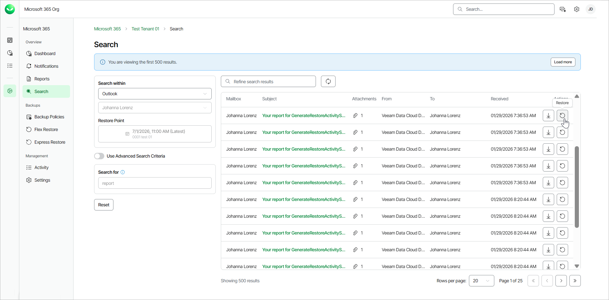
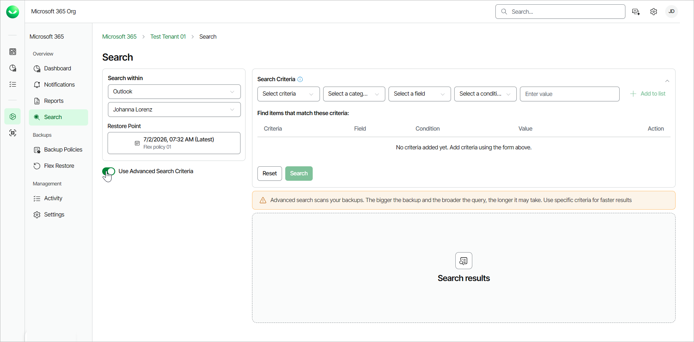
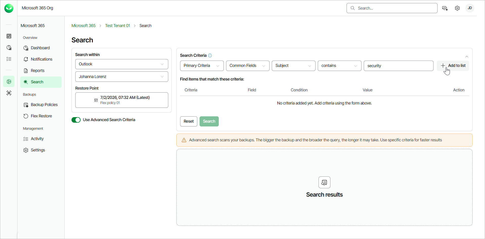
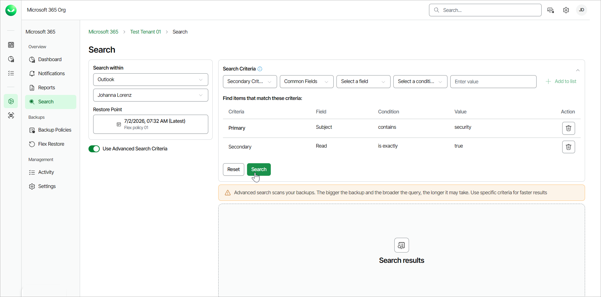
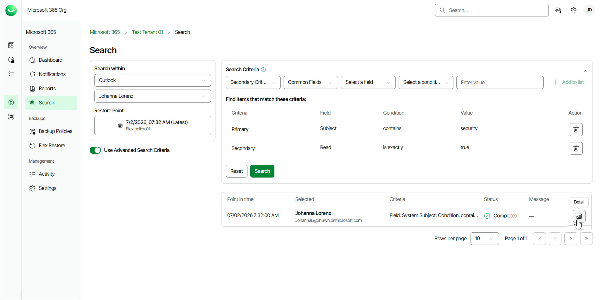
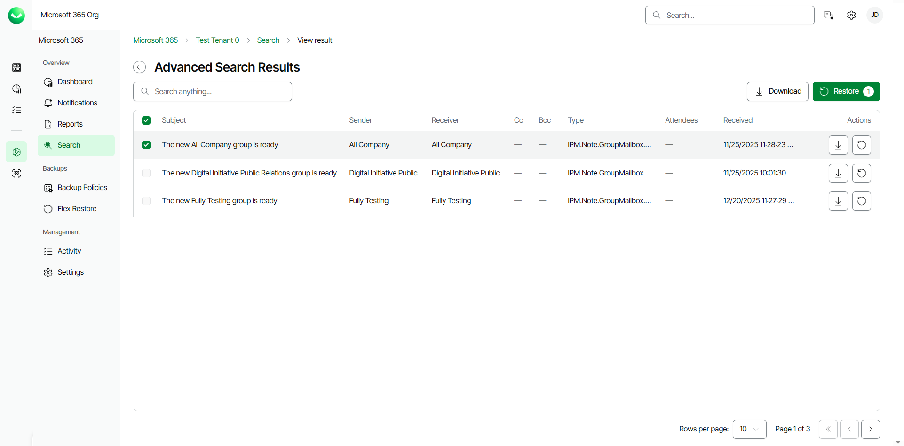

# Searching for Objects in Backup

You can use Veeam Data Cloud for Microsoft 365 to search for objects in your Flex backups. The product offers 2 search mechanisms:

* Search. This is basic search, available for Microsoft Exchange Online, OneDrive documents, SharePoint Online folders and Teams posts backups. You can select a restore point, specify a search word and get results fast.
* Advanced Search. This is advanced search, available for Microsoft Exchange Online, OneDrive, SharePoint Online and Teams backups. You can select a restore point and specify multiple search criteria. It may take a long time to display results.

|  |
| --- |
| tip |
| If you are looking for a specific item to restore, to save time, you can also directly browse your backups for the specific item and time range and then restore it. For example, to restore a specific SharePoint site, click Flex Restore on the left menu, go to the SharePoint tab and select the specific SharePoint site from the tree list or locate it using filtering. Then select the restore options and restore the item. For more information, see [Microsoft 365 Restore](m365_restore.md). |

Performing Basic Search

To search for required items with basic search, do the following:

1. On the Microsoft 365 page, click the name of the tenant whose backed-up items you want to search.
2. Select Search.
3. In the Search page, from the Search within drop-down list, select Outlook, OneDrive, SharePoint or Teams.

1. From the Search drop-down list, select the Outlook mailbox, OneDrive, SharePoint site or Team where you want to search for backed-up items.

1. In the Restore Point field, select a restore point where you want to search for backed-up items and click Apply. The restore point defines the date and time when the backup was created.

1. In the Search for field, specify a keyword for the search.

1. For Outlook, the keyword matches the email subject.

1. For OneDrive, the keyword matches the file name.

1. For SharePoint, the keyword matches the site name or the folders within the site.

1. For Teams, the keyword matches the post subject.

1. Click Search.

1. During the search process, Veeam Data Cloud displays a loading spinner. Once Veeam Data Cloud finds the first 500 items that match the search keyword, the loading spinner disappears. You can view found items or click Load more to find the next 500 items.
2. If you want to restore any of the found items, in the search results, in the Actions column of the item you want to restore, you can do the following actions:

* Click Restore.
* Click Download.

|  |
| --- |
| Tip |
| If you want to start a new search, click Reset. |

Performing Advanced Search

|  |
| --- |
| note |
| Advanced search will need to mount your restore points and may search a very large amount of data. The broader your search criteria and the larger your backup, the longer this will take. Keep searches as specific as you can to ensure the fastest results. |

To search for required items with advanced search, do the following:

1. On the Microsoft 365 page, click the name of the tenant whose backed-up items you want to search.
2. Select Search.
3. In the Search page, from the Search within drop-down list, select the application whose items you want to find: Outlook, OneDrive, SharePoint, or Teams.

If the option to search within a specific application is enabled for your account, you can see the application in the Search within drop-down list. If you cannot see the application whose items you want to find, contact [Veeam Customer Support](https://www.veeam.com/support.html#Data_Cloud_Support).

1. From the Search drop-down list, select the Outlook mailbox, OneDrive, SharePoint site or Team where you want to search for application items.

1. In the Restore Point field, select a restore point where you want to search for application items and click Apply. The restore point defines the date and time when the backup was created.

1. Click the Use Advanced Search Criteria toggle switch.

1. In the Search Criteria section, specify search criteria:

1. From the Select criteria, Select a category, Select a field and Select a condition drop-down lists, select values to form your search criteria.
2. In the Enter value field, specify your search criteria or select a value from a drop-down list.

1. Click Add to list. The selected criteria will be listed in the Find items that match these criteria section.

|  |
| --- |
| Note |
| Primary search criteria are common fields for the specified object type. Secondary search criteria are less commonly used fields for the specified object type. You can specify multiple primary and multiple secondary criteria for each search. Veeam Data Cloud for Microsoft 365 links them as with the OR logical operator. For more information, see [Advanced Search Criteria](m365_search_criteria.md). |

|  |
| --- |
| Tip |
| You can adjust your search criteria at any time.   * To remove a single criterion, in the Action column of the criterion, click Remove. * To clear all the search criteria, click Reset. |

1. Click Search.

1. Veeam Data Cloud will display the In queue status, then the Processing status, and then the Completed status for the search. When the Status changes to Completed, in the Actions column, click Detail to view found items.

1. If you want to restore any of the found items, in the Advanced Search Results page, you can do the following actions:

* Select the check box next to the item you want to restore and click Restore.
* Select the check box next to the item you want to download and click Download.

Page updated 2026-07-08
