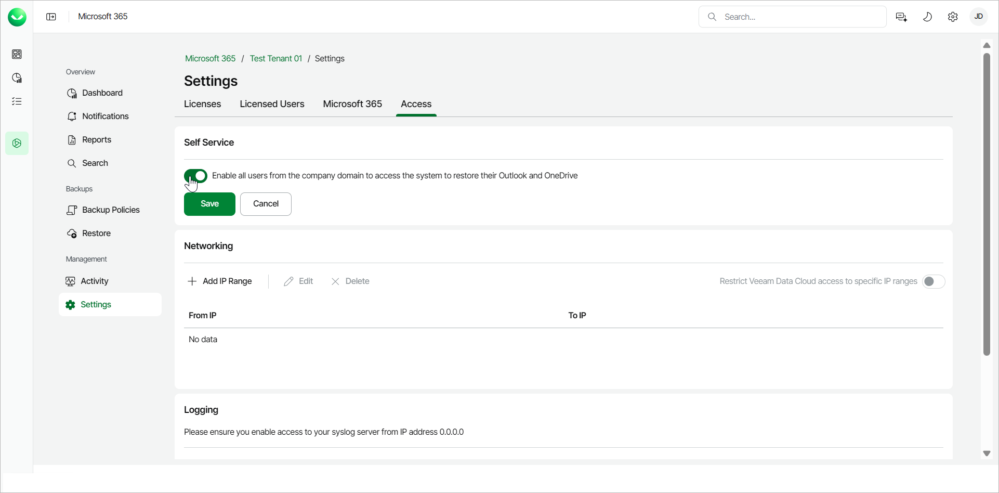

# Performing Self-Service Restore

Veeam Data Cloud for Microsoft 365 allows users under the Flex plan to perform self-service restore of their Outlook and OneDrive data. Once you enable the feature, users within the same domain as your organization, that have not been given access to any workload tenants, will be able to log in to Veeam Data Cloud and perform self-service restore. If you disable the self-service restore feature, the self-service users will no longer be able to log in to Veeam Data Cloud. Self-service users can only restore Outlook and OneDrive data to the original location.

Enabling Self-Service Restore

To enable the self-service restore feature for a workload tenant, do the following:

1. On the Microsoft 365 page, click the name of the tenant you want to manage.
2. Select Settings.
3. Go to the Access tab.
4. In the Self Service section, click the Enable all users from the company domain to access the system to restore their Outlook and OneDrive toggle.

The Self Service section is only visible to users with the OrganizationAdmin or M365:Administrator roles or a custom role with the Manage Tenants permission. For more information about roles, see [Roles](users_roles.md).

1. Click Save.

In This Section

* [Restoring Outlook Data](m365_self_restore_outlook_data.md)
* [Restoring OneDrive Data](m365_self_restore_onedrive_data.md)

