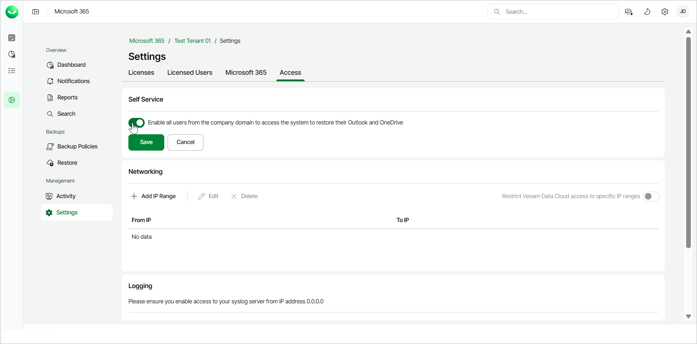
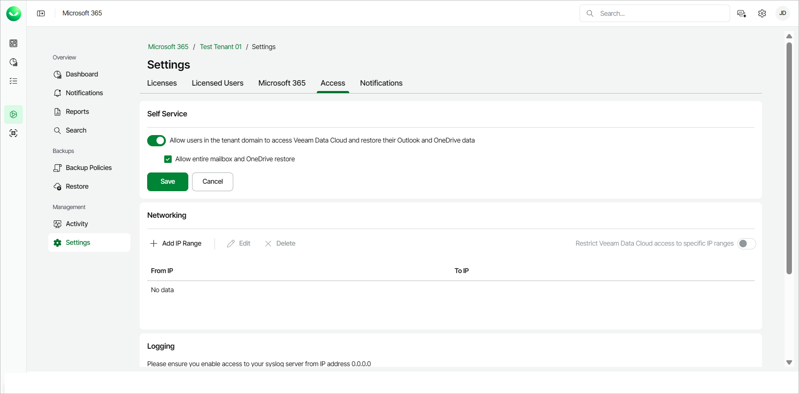

# Performing Self-Service Restore

Veeam Data Cloud for Microsoft 365 allows users under the Foundation plan to perform self-service restore of their Outlook and OneDrive data. You can select whether to allow users to restore their entire mailbox and OneDrive or to only restore specific items within their Outlook mailbox and OneDrive from the backup. Self-service users can only restore Outlook and OneDrive data to the original location.

Once you enable the feature, users within the same domain as your organization, that have not been given access to any workload tenants, will be able to log in to Veeam Data Cloud and perform self-service restore. The self-service users do not require an invitation to your Veeam Data Cloud organization or role assignments. If you want users who already have access to a workload tenant to be able to perform self-service restore, you must remove them from your Veeam Data Cloud organization. For information on how to remove a user, see [Deleting Users](users_delete.md).

If you disable the self-service restore feature, the self-service users will no longer be able to log in to Veeam Data Cloud.

Enabling Self-Service Restore

To enable the self-service restore feature for a workload tenant, do the following:

1. On the Microsoft 365 page, click the name of the tenant you want to manage.
2. Select Settings.
3. Go to the Access tab.
4. In the Self Service section, click the Allow users in the tenant domain to access Veeam Data Cloud and restore their Outlook and OneDrive data toggle. When you enable this feature, self-service users will be able to restore specific items within their Outlook mailbox and OneDrive to a restore point of their choice from the backup.

The Self Service section is only visible to users with the OrganizationAdmin or M365:Administrator roles or a custom role with the Manage Tenants permission. For more information about roles, see [Roles](users_roles.md).

1. [Optional] Select the Allow entire mailbox and OneDrive restore check box. If you enable this setting, self-service users will be able to restore and overwrite their entire mailbox and OneDrive to a restore point of their choice from the backup.

1. Click Save.

In This Section

* [Restoring Outlook Data](m365_self_restore_outlook_data.md)
* [Restoring OneDrive Data](m365_self_restore_onedrive_data.md)

