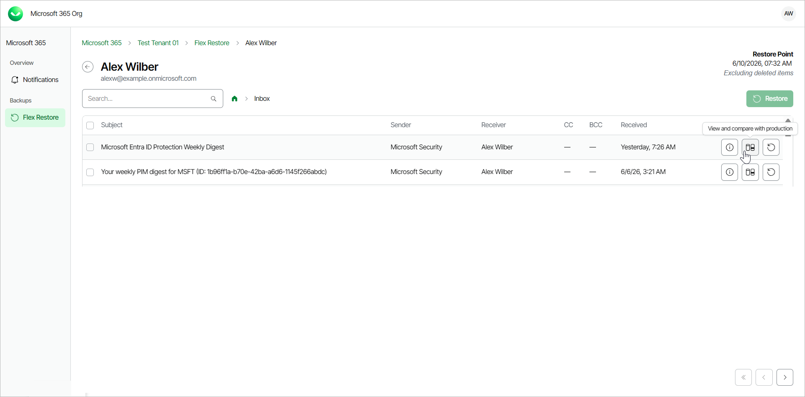
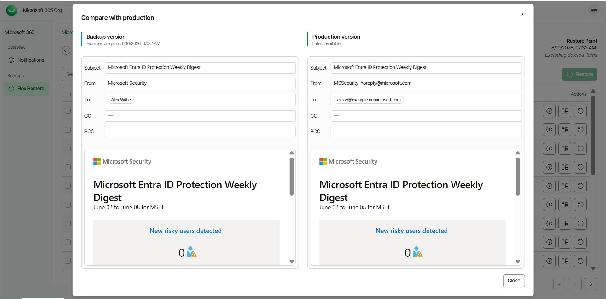

# Comparing Outlook Email with Production

Veeam Data Cloud for Microsoft 365 allows self-service users to compare their backed-up Outlook emails with their versions in the production environment before performing restore.

To compare an email with the production environment:

1. Log in to Veeam Data Cloud for Microsoft 365.
2. In Veeam Data Cloud for Microsoft 365, in the Outlook tab, you can view your Outlook data from the latest backup.
3. Click on the folder that contains the email you want to view.
4. Locate the email you are looking for and, in the Actions column, click View and compare with production.

1. In the Compare with production window, compare properties of the email between the Backup version and the Production version. You can compare the following information:

* Subject — subject of the email.
* From — sender of the email.
* To — receiver of the email.
* CC — contacts to whom a copy of the email was sent.
* BCC — contacts to whom a blind copy of the email was sent.
* Attachments — files attached to the email.
* Body — the body of the email.

|  |
| --- |
| TIP |
| The administrator of the organization can specify whether the self-service users can compare their backed-up emails with the production versions. For more information, see [Enabling Self-Service Restore](m365_settings_enable_self_service.md#selfenable). |

