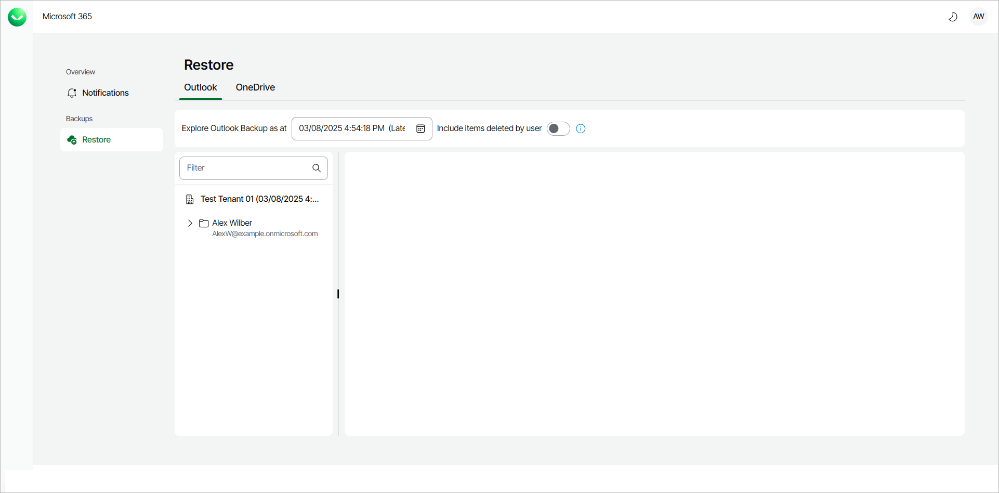
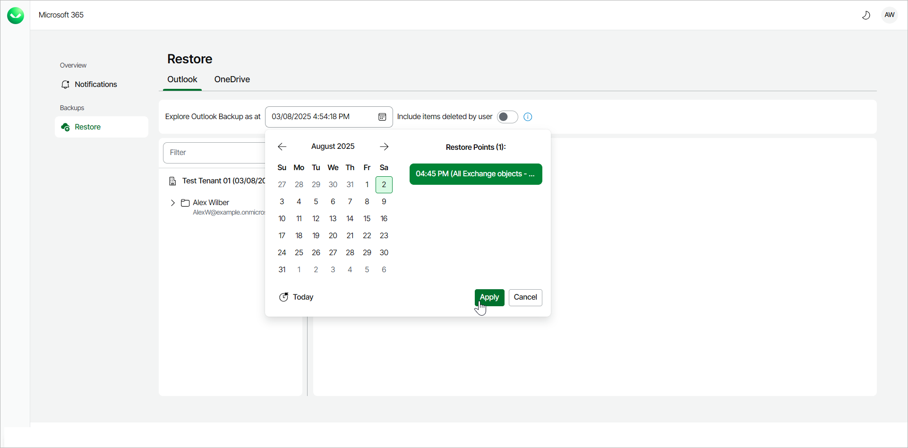
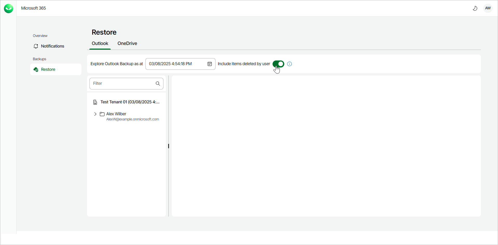
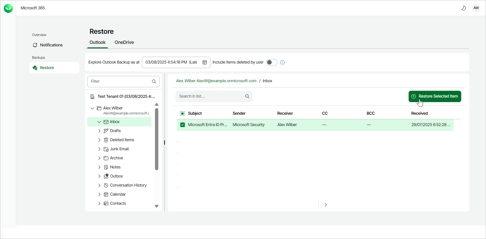
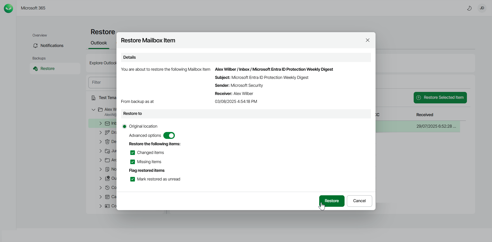
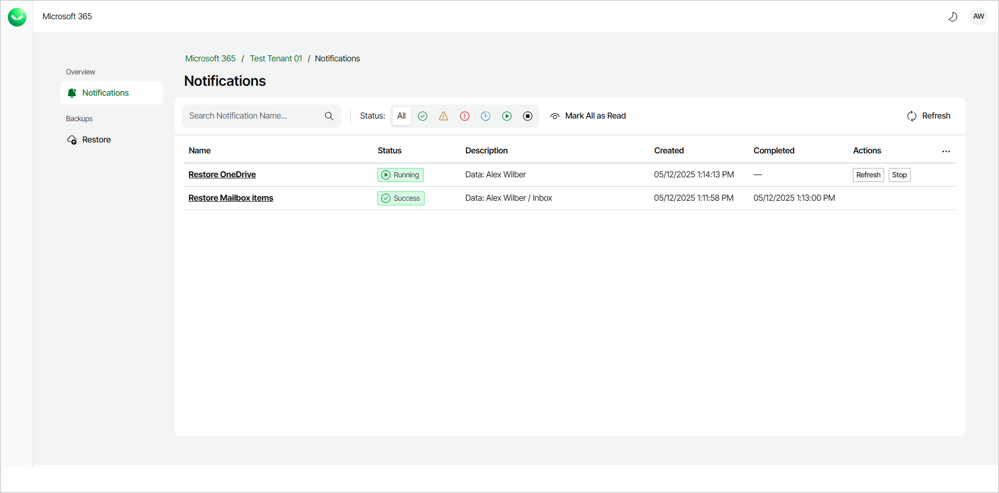

# Restoring Outlook Data

In this article

Veeam Data Cloud for Microsoft 365 allows self-service users to restore their Microsoft Outlook data.

To restore Outlook data:

1. Log in to Veeam Data Cloud for Microsoft 365.
2. In Veeam Data Cloud for Microsoft 365, in the Outlook tab, you can view your Outlook data from the latest backup.

1. By default, Veeam Data Cloud uses the latest available restore point for data restore. If you want to select another restore point, in the Explore Outlook Backup as at field, click the calendar and select the date and time when the necessary restore point was created.

1. If you want to see items that may have been deleted, click the Include items deleted by user toggle.

1. Select the mailbox or a folder that contains the item you want to restore.
2. Locate the item you are looking for and select it. Selected items are highlighted in green.
3. Click Restore Selected Item.

1. The Restore Mailbox Item window will appear, providing you with the details of the item you are going to restore. If needed, you can also use the Advanced options toggle to display more options.

Click Restore to start the restore process.

The item will be restored to the same location in the original Outlook mailbox as it was found in the backup.

1. Veeam Data Cloud for Microsoft 365 will display a notification that the restore process has started.

You will also be able to view the progress of the restore process by clicking Notifications.

1. Once the restore process is completed, you will be able to navigate back to your mailbox and check that the Outlook data has been restored.

Page updated 12/5/2025
