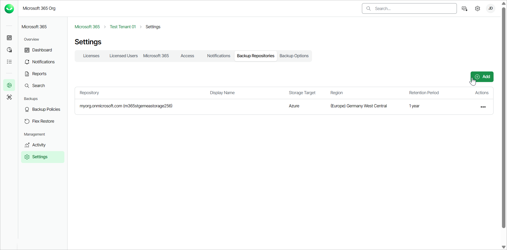
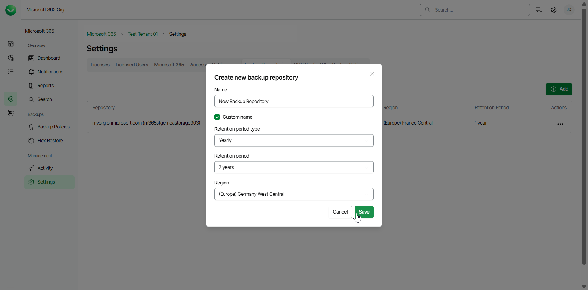
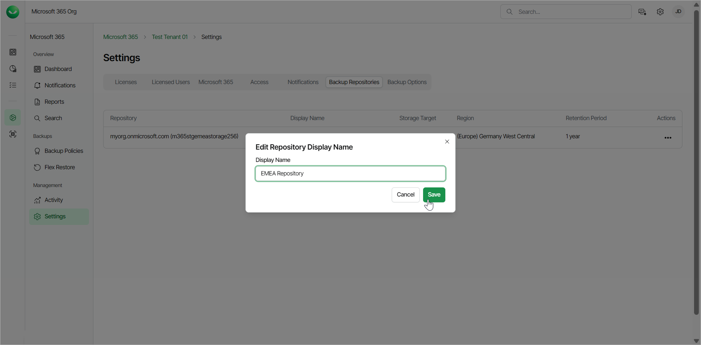
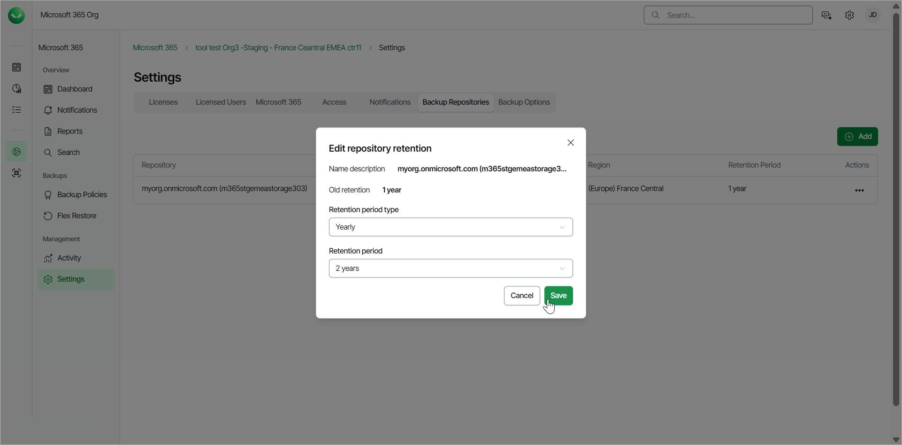
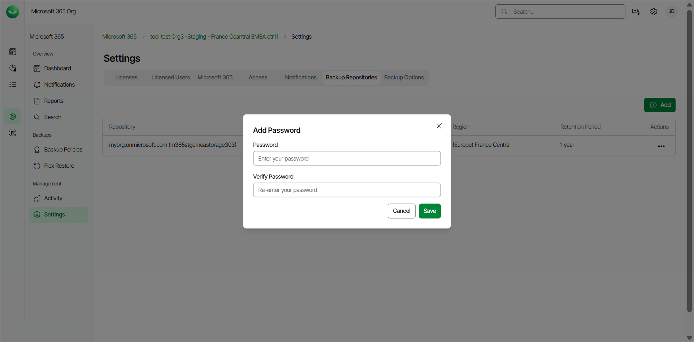

# Managing Backup Repositories

Veeam Data Cloud for Microsoft 365 uses backup repositories as a storage system for backups. Users can edit their backup repositories, add new backup repositories within their storage region, and supply their own encryption password for a backup repository.

Only users with the OrganizationAdmin or M365:Administrator roles or a custom role with the Manage Tenants permission can manage the backup repositories of their tenant. For more information about roles, see [Roles](users_roles.md).

Creating Backup Repositories

To create a new backup repository, do the following:

1. On the Microsoft 365 page, click the name of the tenant you want to manage.
2. Select Settings.
3. Go to the Backup Repositories tab.
4. Click Add.

1. In the Create new backup repository window, do the following:

1. Select the Custom name check box if you want to specify a name for the backup repository. Otherwise, Veeam Data Cloud generates the name automatically based on the name of your organization.
2. From the Retention period type drop-down list, select the type of the retention period:

* Yearly. If you select this option, from the Retention period drop-down list, select the number of years for the retention period.
* Daily. If you select this option, in the Number of days field, specify the number of days for the retention period.

1. From the Region drop-down list, select the region where you want to store your data.
2. Click Save.

|  |
| --- |
| note |
| When you create a new backup repository and want to include an object from an existing backup repository, Veeam Data Cloud performs a full backup of that object, which takes time.  For example, you have the existing backup repository where you are backing up a mailbox, with retention set to 1 year. Then you add a new backup repository with retention set to 3 years. You create a backup policy, that stores the backup data in the new repository, that includes the mailbox and you remove this mailbox from the backup policy in the existing repository. In this case, Veeam Data Cloud performs a full backup for the mailbox in the new backup repository, which takes time. The mailbox will remain in the existing backup repository until the 1-year retention ends. |

Editing Backup Repositories

To edit a backup repository, do the following:

1. On the Microsoft 365 page, click the name of the tenant you want to manage.
2. Select Settings.
3. Go to the Backup Repositories tab.
4. In the Actions column, click the menu next to the backup repository you want to edit.
5. Click Edit display name to modify the display name of the backup repository. This name will be visible when selecting the storage region during the creation of a new backup policy. In the Edit Repository Display Name window, specify a new display name for the backup repository and click Save.

1. Click Edit retention to modify the retention settings of the backup repository. In the Edit repository retention window, from the Retention period type drop-down list, select Yearly or Daily. Then specify the number of years or days for the retention period.

1. Click Set your own password to enable encryption for the backup repository. In the Add Password window, provide a password, verify that password and click Save.

If you want to update your password, click Change encryption password. In the Update Password window, provide the existing password, specify a new password, verify it and click Save.

|  |
| --- |
| note |
| If you forgot your encryption password, contact Veeam Customer Support. |

